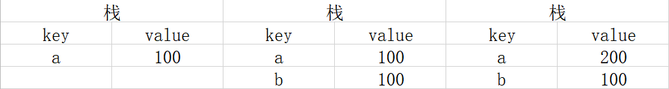
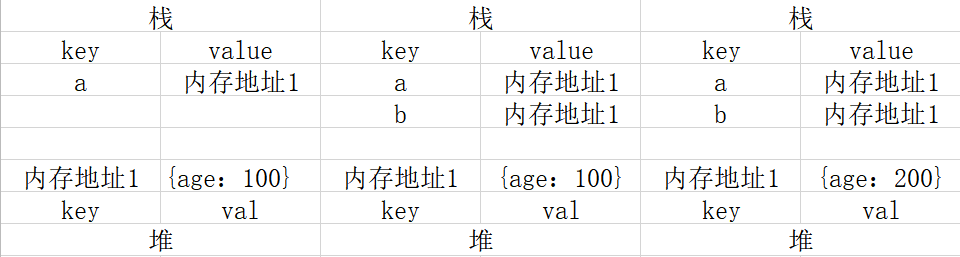

# JS 变量类型和计算

* 题目
  * typeof 能判断哪些类型
  * 何时使用 === 何时使用 ==
  * 值类型和引用类型
  * 手写深拷贝
* 知识点
  * 变量类型
    * 值类型 vs 引用类型
    * typeof运算符
    * 深拷贝
  * 变量计算
* 解答

## 值类型 和 引用类型

值类型

```js
let a = 100
let b = a
a = 200
console.log(b) // 100
```

值类型的变量赋值保持不变

引用类型

```js
let a = {age: 100}
let b = a
a.age = 200
console.log(b.age)  // 200
```

引用类型会改变赋值

值类型

引用类型


考虑到性能问题，值占用的空间比较小
而引用类型一般比较大，复制比较慢

* 浅拷贝代码

```js
let person = {
  name: 'wang',
  age: 14
}

function shallowClone(obj) {
  let newObj = {}
  for(let key in obj) {
    if (obj.hasOwnProperty(key)) {
      newObj[key] = obj[key]
    }
  }
  return newObj
}

let newPerson = shallowClone(person)
```

常见值类型和引用类型

```js
// 值类型
let a // undefined const 定义会报错
const s = 'ssssss' // string
const n = 100 // number
const b = true // Boolean
const s = Symbol('s') // ES6 Symbol类型

// 引用类型
const obj = {x: 200}
const arr = [1, 2, 3]
const n = null // 特殊引用类型,指针指向为空地址

// 特殊引用类型,但不用于存储数据,所以没有"拷贝, 复制"函数这一说
function fn() {}
```

* typeof 运算符
  * 识别所有值类型
  * 识别函数
  * 判断是否是引用类型(不可细分)

```js
// 判断所有值类型
let a;                  typeof a // undefined
const str = 'abc'       typeof str // string
const n = 100           typeof n // number
const b = true          typeof b // boolean
const s = Symbol('s')   typeof s // symbol
// 能判断函数
typeof function () {} // function

// 能识别引用类型,不能继续识别
typeof null // object
typeof [1, 2] // object
typeof {x: 100} // object
```

### 深拷贝

```js
function deepClone(obj) {
  if (typeof obj !== 'object' || obj == null) {
    return obj
  }
  let res = Array.isArray(obj) ? [] : {}
  for (let key in obj) {
    if (obj.hasOwnProperty(key)) {
      res[key] = deepClone(obj[key])
    }
  }
  return res
}
```

## 变量计算 - 类型转换

* 字符串拼接
* ==
* if语句和逻辑运算

### 字符串拼接

```js
const a = 100 + 10  // 110
const b = 100 + '10'  // '10010'
const c = true + '10' + 'true10'

const d = 100 + parseInt('10') // 110
```

### == 运算符

```js
100 == '100' // true
0 == ''  // true
0 == false  // true
false == ''  // true
null == undefined  // true

// 除了 == null 之外， 其他一律用 === 

const obj = {x: 100}
if (obj.a == null) {}
// 相当于：
// if (obj.a === null || obj .a === undefined) {}
```

### if 语句和逻辑运算

* truly变量：!!a === true
* falsely 变量：!!a === false 的变量

```js
// 以下是falsely变量，除此之外都是truly变量

!!0 === false
!!NaN === false
!!'' === false
!! null === false
!! undefined === false
!! false === false

// if判断的其实是 truely 和 falsely
```
