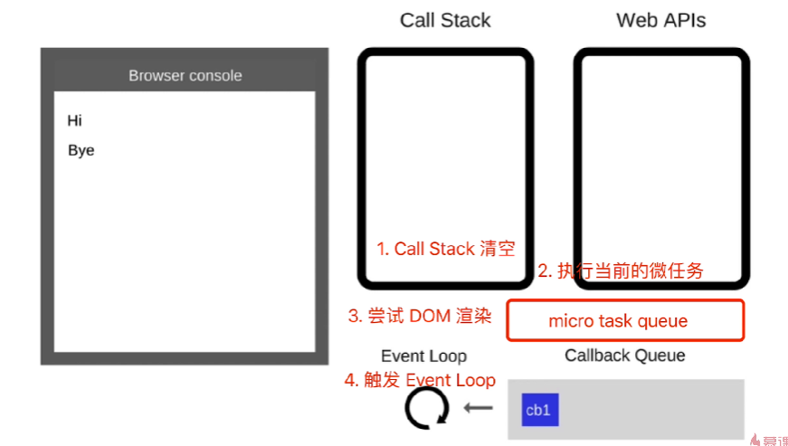

# JS 异步 进阶

* 之前讲解JS异步，在于初阶的应用
* 本章在于JS异步的原理和进阶

## 主要内容

* event loop
* promise 进阶
* async/await
* 微任务/宏任务

## 问答题

* 请描述event loop（事件循环/事件轮询）的机制，可画图
* 什么是宏任务和微任务，两者有什么区别
* Promise 有哪三种状态？如何变化

## 场景题

```js
// 场景题
async function fn() {
  return 100
}
(async function () {
  const a = fn() // ?
  const b = await fn() // ?
})()

(async function () {
  console.log('start')
  const a = await 100
  console.log('a', a)
  const b = await Promise.resolve(200)
  console.log('b', b)
  const c = await Promise.reject(300)
  console.log('c', c)
  console.log('end')
})()


// 场景题
Promise 和 setTimeout的顺序
console.log(100)
setTimeout(() => {
  console.log(200)
})
Promise.resolve().then(() => {
  console.log(300)
})
console.log(400)

// 外加 async/await的顺序问题
async function async1() {
  console.log('async1 start')
  await async2()
  console.log('async1 end')
}

async function async2() {
  console.log('async2')
}
console.log('script start')

setTimeout(function () {
  console.log('settimeout')
}, 0)

async1()

new Promise((resolve, reject) => {
  console.log('promise1')
  resolve()
}).then(() => {
  console.log('promise2')
})

console.log('script end')
```

## event loop (事件循环/事件轮询)

* JS 是单线程运行的
* 异步要基于回调实现
* event loop就是异步回调的实现原理

## JS如何执行

* 从前到后，一行一行
* 某一行错误，停止执行
* 先同步，后异步

```js
// 示例
console.log('Hi)
setTimeout(function cb1() {
  console.log('cb1)
}, 5000)
console.log('Bye)
```

## 总结event loop过程1

* 同步代码，一行一行放在Call Stack执行
* 遇到异步，会先记录下，等待时机（定时，网络请求等）
* 时机到了，就会移动到CallBack Quene

## 总结event loop过程2

* 如果Call Stack为空（即同步代码执行完）event loop开始工作
* 轮询查找Callback Quene，如有则移动到Call Stack执行
* 然后继续轮询查找

## DOM事件和 event loop

* JS 是单线程的
* 异步（setTimeout，ajax等）使用回调，基于event loop
* DOM事件也使用回调，基于event loop（什么时候用户点击了，什么时候使用回调函数）

## Promise

* 三种状态
* 状态变化和表现
* then和catch对状态的影响

## 三种状态

* pending resolved（fulfilled） rejected
* pending --> resolved 或 pending --> rejected
* 变化不可逆

## then 和 catch 改变状态

* then 正常返回resolved，里面有报错则返回rejected
* catch 正常返回resolved，里面有报错则返回rejected

## async / await

* 异步回调 callback hell
* Promise then catch 链式调用，但是也基于回调函数
* async。await 是同步语法，彻底消灭回调函数

## async 和 Promise的关系

* async / await 是消灭异步回调的终极武器
* 但和Promise不冲突
* 两者相辅相成
* 执行async函数返回的是Promise对象
* await 相当于 Promise 的 then
* try catch 可以捕获异常，代替了Promise 的 catch

## 异步的本质

* async / await 是消灭异步回调的终极武器
* js还是单线程，还是得有异步，还是得基于event loop
* async / await 只是一个语法糖

```js
async function async1() {
  console.log('async1 start') // 2 重要
  await async2()
  // await 后面，都可以看作是 callback 里的内容，即异步
  console.log('async1 end') // 5
}

async function async2() {
  console.log('async2')  // 3 重要
}

console.log('script start') // 1
async1()
console.log('script end')  // 4


// 复杂一点
function testSometing() {
 console.log("执行testSometing");  // 2
 return "testSometing";  // job quene1  5
}
 
async function testAsync() {
 console.log("执行testAsync"); // 6
 return Promise.resolve("hello async");  // job quene3  8
}
 
async function test() {
 console.log("test start...");  // 1
 const v1 = await testSometing();
 console.log(v1);
 const v2 = await testAsync();
 console.log(v2);
 console.log(v1, v2);  //9
}
 
test(); // 执行test
 
var promise = new Promise((resolve)=> { 
  console.log("promise start..");  // 3
  resolve("promise");  // job quene2  7
})
promise.then((val)=> console.log(val));
 
console.log("test end...")  // 4


// 答案
// test start
// 执行 something
// promise start
// test end
// testSomething
// 执行testAsync
// promise
// hello async
// testsomething hello async 
```

## for... of

* for... in（以及forEach、for）是常规的同步遍历
* for... of (常用于异步的遍历)

## 宏任务 macroTask 和 微任务 microTask

* 什么是宏任务，什么是微任务
* event loop 和 DOM渲染
* 微任务和宏任务的区别

## 宏任务 和 微任务

* 宏任务：seTimeout，setInterval，Ajax，DOM事件
* 微任务：Promise async/await
* 微任务执行时机比宏任务要早

## event loop 和 DOM渲染

* 每次 Call Stack 清空（即每次轮询结束），即同步任务完成
* 都是DOM重新渲染的机会，DOM结构如果有改变则重新渲染
* 然后再去触发下一次Event loop

## 微任务和宏任务的区别

* 宏任务：DOM渲染后触发，如setTimeout
* 微任务：DOM渲染前触发，如Promise

## 从event loop解释为什么微任务比宏任务早执行

* 微任务是ES6语法规定
* 宏任务是由浏览器规定的



## 手写Promise

* 初始化
* then catch 链式调用
* API .resolve .reject .all .race

## 总结

* event loop
* promise进阶
* async/await
* 微任务/宏任务
