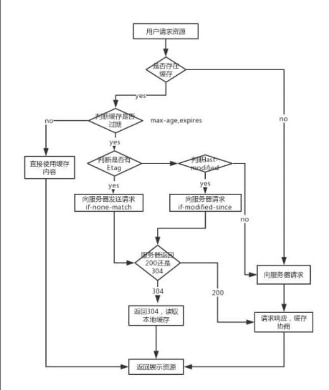

# http面试题

* 前端工程师开发界面
* 需要调用后端的接口，提交/获取 数据 --- http协议
* 要求掌握好ajax

## 题目

* http常见状态码
* 常见的header有哪些
* 什么是Restful API
* 描述一下http缓存机制（重要）

## http状态码

* 状态码分类
* 常见状态码
* 关于协议和规范

## 状态码分类

* 1xx 服务器收到请求
* 2xx 请求成功，如200
* 3xx 重定向，如302
* 4xx 客户端错误，如404
* 5xx 服务端错误，如500

## 常见状态码

* 200 成功
* 301 永久重定向（配合location，浏览器自动处理）
* 302 临时重定向（配合location，浏览器自动处理）
* 304 资源未被修改
* 404 资源未找到
* 403 没有权限
* 500 服务器错误
* 504 网关超时

## http methods

* 传统 methods
* 现在 methods
* restFul API

## 传统 methods

* get 获取服务器数据
* post 向服务器提交数据
* 简单的网页功能，就这两个操作

## 现在的methods

* get 获取数据
* post 新建数据
* patch/put 更新数据
* delete 删除数据

## Restful API

* 一种新的API设计方法
* 传统API设计：把每个url当作一个功能
* Restful API设计：把每个url当作一个唯一的资源

## 如何设计成一个资源

* 尽量不用url参数
* 用methods表示操作类型

## 不用url参数

* 传统API设计：/api/list?pageIndex=2
* Restful API设计：/api/list/2

## 用method 表示操作类型（传统API设计）

* post请求 /api/create-blog
* post请求 /api/update-blog？id=100
* 个体请求 /api/get-blog？id=100

## 用method 表示操作类型（Restful API设计）

* post请求  /api/blog
* patch请求  /api/blog/100
* get请求  /api/blog/100

## http headers

* 常见的 Request headers
* 常见的 response headers

## Request Headers

* Accept 浏览器可接收的数据格式
* Accept-Encoding 浏览器可接收的压缩算法，如gzip
* Accept-language 浏览器可接收的语言，如zh-cn
* Connection：keep-alive 一次tcp链接重复使用
* cookie
* Host
* User-Agent（简称 UA）浏览器信息
* Content-type 发送数据格式，如application/json

## Response Headers

* Content-type 返回数据格式，如application/json
* Content-length 返回的数据大小，多少字节
* Content-Encoding 返回数据的压缩算法，如gzip

## http缓存

* 关于缓存的介绍
* http缓存策略（强制缓存+协商缓存）
* 刷新操作方式，对缓存的影响

## 关于缓存

* 什么是缓存
  * 缓存是一种保存资源副本并在下次请求时直接使用该副本的技术。当 web 缓存发现请求的资源已经被存储，它会拦截请求，返回该资源的拷贝，而不会去源服务器重新下载。这样带来的好处有：缓解服务器端压力，提升性能(获取资源的耗时更短了)。对于网站来说，缓存是达到高性能的重要组成部分。缓存需要合理配置，因为并不是所有资源都是永久不变的：重要的是对一个资源的缓存应截止到其下一次发生改变（即不能缓存过期的资源
* 为什么需要缓存
  * 通过复用以前获取的资源，可以显著提高网站和应用程序的性能。Web 缓存减少了等待时间和网络流量，因此减少了显示资源表示形式所需的时间。通过使用 HTTP缓存，变得更加响应性。
* 哪些资源可以被缓存---一些静态资源（js css img）

## http 强制缓存

* 浏览器初次请求服务器资源，服务器返回资源，如果可以被缓存，添加cache-Control
* 再次请求，本地存储返回资源

## Cache-Control

* Response Headers 中
* 控制强制缓存的逻辑
* 例如 Cache-Control：max-age=30000

## cache-control的值

* max-age
* no-cache（不强制缓存，服务端处理）
* no-store（不强制缓存，服务端也不处理，直接返回）
* private
* public

## http 缓存--协商缓存（对比缓存）

* 服务端缓存策略
* 服务端判断客户端资源，是否和服务端资源一样
* 一致返回304，否则返回200和最新的资源
* 初次请求，返回资源，和资源标识符
* 再次请求，带着资源标识
* 返回304，或者返回资源和新的标识符

## 资源标识

* 在Response Headers 中，有两种
* Last-Modified 资源的最后修改时间
* Etag 资源的唯一标识（一个字符串，类似认的指纹）

## Last-Modified 和 Etag

* 会优先使用Etag
* Last-Modified 只能精确到秒级
* 如果资源被重复生成，而内容不变，则Etag更精确

## 三种刷新

* 正常操作：url
* 手动刷新：F5
* 强制刷新：ctrl + F5

## 缓存策略

* 正常操作：强制缓存有效，协商缓存有效
* 手动刷新：强制缓存失效，协商缓存有效
* 强制刷新：都失效

