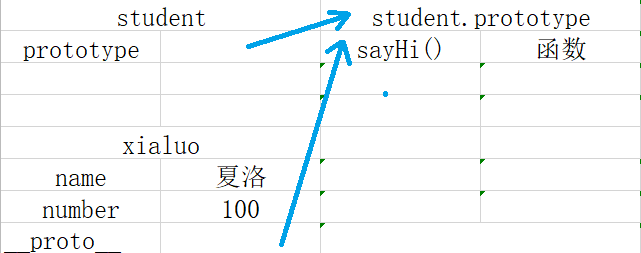
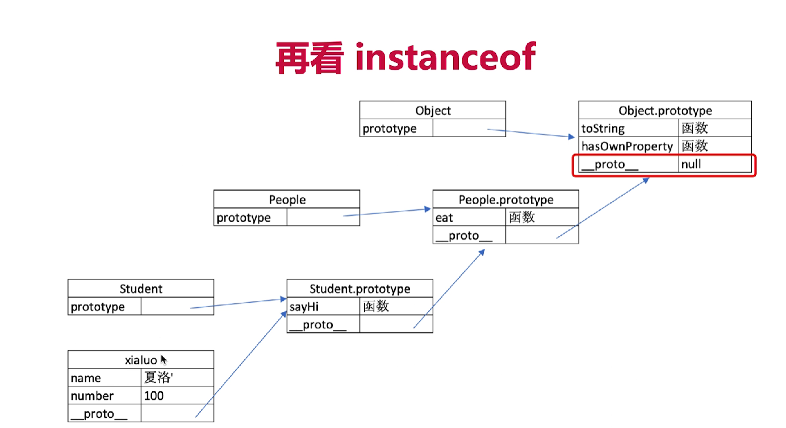

# 原型和原型链

* 如何判断一个变量是不是数组
* 手写一个jQuery，考虑插件扩展性
* class的原型本质，怎么理解

## 面向对象

* 类：类是对象的类型模板
* 实例：是根据类创建的对象
* 所以，类和实例是面向对象的两个基本概念
* js通过prototype实现面向对象编程

## class

* constructor
* 属性
* 方法

## 类继承

```js
class People {
  constructor(name) {
    this.name = name
  }
  eat() {
    console.log(`${this.name} eat something`)
  }
}

class Student extends People {
  constructor(name, number) {
    super(name)
    this.number = number
  }
  sayHi() {
    console.log(`name: ${this.name}, number: ${this.number}`)
  }
} 

const p = new People('zhang')
const s = new Student('wang', 23)
```

## 类型判断 instanceof

```js
p instanceof People // true
s instanceof Student // true

s instanceof Object // true

[] instanceof Array // true
[] instanceof Object // true
{} instanceof Object // true


```

## 原型

* `class`实际上是函数，可见是语法糖
* 每个函数就是一个对象（Function），函数对象都有一个子对象 prototype对象，类是以函数的形式来定义的。prototype表示该函数的原型，也表示一个类的成员的集合。
* 在通过new创建一个类的实例对象的时候，prototype对象的成员都成为实例化对象的成员。
1、该对象被类所引用，只有函数对象才可引用；
2、在new实例化后，其成员被实例化，实例对象方可调用。
同时，函数是一个对象，函数对象若直接声明成员，不用被实例化即可调用。

* `prototype`属性，它是函数所独有的，它是从一个函数指向一个对象。它的含义是函数的原型对象，也就是这个函数（其实所有函数都可以作为构造函数）所创建的实例的原型对象; 这个属性是一个指针，指向一个对象，这个对象的用途就是包含所有实例共享的属性和方法（我们把这个对象叫做原型对象）;
* `__proto__` 是原型链查询中实际用到的，它总是指向 prototype（原型对象），换句话说就是指向构造函数的原型对象，它是对象独有的。注意，为什么Foo构造也有这个属性呢，因为在js的宇宙里万物皆对象，包括函数；

## 原型关系

* 每个class都有显式原型prototype
* 每个实例都有隐式原型__proto__
* 实例的__proto__指向对应class的prototype

## 原型链

* 原型对象也可能拥有原型，并从中继承方法和属性，一层一层、以此类推。这种关系常被称为原型链 (prototype chain)，它解释了为何一个对象会拥有定义在其他对象中的属性和方法。在对象实例和它的构造器之间建立一个链接（它是__proto__属性，是从构造函数的prototype属性派生的），之后通过上溯原型链，在构造器中找到这些属性和方法

* JS常被描述为一种基于原型的语言--每个对象拥有一个原型对象，当试图访问一个对象的属性时，它不仅仅在该对象上搜寻，还会搜寻该对象的原型，以及该对象原型的原型，依次层层向上搜索，知道找到一个名字匹配的属性或者达到原型链的末尾。准确地说，这些属性和方法定义在Object的构造器函数（constructor functions）之上的prototype属性上，而非实例对象本身

* 原型链的优缺点
  * 类似于 原型模式和继承模式的区别
  * 原型：共享原型的属性和方法，减少对象创建时间，节省内存。缺点，共享可能会导致相互冲突和污染
  * 继承和原型相反

```js
class A {}
class B extends A {}

const b = new B()
```


## instanceof 实现



## js继承方法

```js
// 第一种：原型链继承
// 弊端：原型链继承，当原型中存在引用类型值时，示例可以修改其值
function A() {}
A.prototype.getName = function() {}
function B() {}
B.prototype = new A()
B.prototype.constructor = B

// 第二种：修改构造函数this指向
// 弊端：只能继承父对象的实例属性和方法，不能继承父对象原型属性和方法
// 无法实现函数复用
 function A() {}
 A.prototype.getName = function() {}
 function B() {
   A.call(this)
 }
 B.prototype.say = function() {}

 // 第三种：组合继承
 // 缺点：父类构造函数会被调用两次

 function A() {}
 A.prototype.getName = function() {}

 function B() {
   A.call(this)
 }
 B.prototype = new A()
 B.prototype.constructor = B

 //  第四种 寄生式组合继承
 function A() {}
 A.prototype.getName = function () {}

 function B() {
   A.apply(this, arguments)
 }
 B.prototype = Object.create(A.prototype)
 B.prototype.constructor = B
```

## 题目解答

* 如何准确判断一个变量是不是数组
  * arr instanceof Array

* 手写jQuery，考虑插件和扩展性
  * 见上一级`code`文件夹

* class原型的本质
  * 原型和原型链的图
  * 属性的方法和执行规则
  * class 是 构造函数的语法糖，构造函数有原型对象prototype，prototype上的constructor指向构造函数本身，构造函数可以通过原型对象添加方法，构造函数创建的实例对象有__proto__原型指向 构造函数的原型对象
