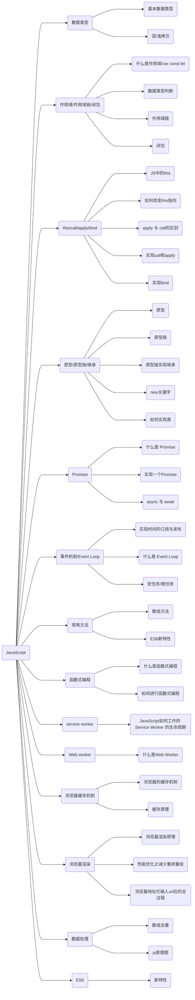

# JavaScript



## 1. 数据类型

javascript 的数据类型、数据检查、深浅拷贝，是 js 最基础的内容

### 1.1 基本数据类型

基本数据类型都是一些简单的数据段，它们是存储在栈内存中

- string
- number
- boolean
- undefined
- null
- Symbol
- bigInt

### 1.2 引用数据类型

引用数据类型是保存在堆内存中的，然后再栈内存中保存一个对堆内存中实际对象的引用。所以，`JavaScript 中对引用数据类型的操作都是操作对象的引用而不是实际的对象`

- Array
- Object

### 1.3 为什么基础数据类型存在栈中，而引用数据类型存在堆中呢

- 堆比栈大，栈比堆速度快。
- 基础数据类型比较稳定，而且相对来说占用的内存小。
- 引用数据类型大小是动态的，而且是无限的。
- 堆内存是无序存储，可以根据引用直接获取。

### 1.4 浅拷贝与深拷贝

- 浅拷贝
  - 浅拷贝的意思就是只复制引用，而未复制真正的值
- 深拷贝

  - 深拷贝就是对目标的完全拷贝，不像浅拷贝那样只是复制了一层引用，就连值也都复制了
  - JSON.stringify/parse 方法

  ```js
  function DeepClone2(obj) {
    let _obj = JSON.stringify(obj);
    let objClone = JSON.parse(_obj);
    return objClone;
    // 存在一些问题
    // 1.无法拷贝undefined、function、Symbol
    // 2.如果对象中有时间对象，则JSON.stringify后再 parse的结果，时间将只是字符串形式，而不是对象形式
    // 3.对象中有正则、Error对象、则序列化的结果将只能得到空对象
    // 4.对象中有NaN、Infinity，序列化后会变成null
    // 5.JSON。stringify 只能序列化对象的可枚举的自有属性，如果对象中的对象是由构造函数生成的，会丢弃constructor
  }
  ```

  - 递归实现深拷贝

  ```js
  function deepClone(obj) {
    if (typeof obj !== "object" || obj == null) {
      return obj;
    }

    // 初始化返回值
    let result = Array.isArray(obj) ? [] : {};

    for (let key in obj) {
      if (obj.hasOwnProperty(key)) {
        // 保证key不是原型的属性
        //递归
        result[key] = deepClone(obj[key]);
      }
    }
    return result;
  }
  ```

## 2. 作用域

### 2.1 执行上下文的理解

简而言之，`执行上下文是评估和执行 JavaScript 代码环境的抽象概念`。每当 Javascript 代码在运行的时候，它都是在执行上下文中运行

### 2.2 执行上下文的类型

JS 有三种类型的执行上下文

- 全局执行上下文 --- 是默认或者基础的上下文，任何不在函数内部的代码都会在全局上下文中。`它会执行两件事：创建一个全局的 window 对象（浏览器情况下），并且设置 this 的值等于这个全局变量。一个程序中只会有一个全局执行上下文`

- 函数执行上下文 --- `每当一个函数被调用时都会为该函数创建一个新的上下文`。每个函数都有它自己的执行上下文，不过是在函数被调用时创建的。函数上下文可以有任意多个。每当一个新的执行上下文被创建，它会按定义的顺序执行一系列步骤。

- Eval 函数执行上下文 --- 执行在 eval 函数内部的代码也会有自己的执行上下文。

### 2.3 执行栈

- 执行栈，也就是在其它编程语言中所说的“调用栈”，`是一种拥有 LIFO（后进先出）数据结构的栈，被用来存储代码运行时创建的所有执行上下文`。

- 当 JavaScript 引擎第一次遇到脚本时，他会创建一个全局的执行上下文并且压入当前执行栈。`每当引擎遇到一个函数调用，他会为该函数创建一个新的执行上下文并压入栈的顶部`.

- 引擎会执行那些执行上下文位于栈顶的函数.每当函数执行结束之后，最上层的执行上下文从栈中弹出，控制流程到达当前栈中的下一个上下文

- 一旦所有代码执行完毕，JavaScript 引擎从当前栈中移除全局执行上下文

### 2.4 怎样创建执行上下文

- 有两个阶段

  1. 创建阶段
  2. 执行阶段

- 创建阶段

  - 在 JavaScript 代码执行前，执行上下文将经历创建阶段。在创建阶段将会发生三件事

    - `this` 值的绑定
    - 创建词法环境
    - 创建变量环境

  - this 绑定

    - 在全局执行上下文中,`this` 的值指向全局对象(在浏览器中,全局对象为 `window`)
    - 在函数执行上下文中,`this` 的值取决于该函数是如何被调用的.如果他被一个引用类型对象调用,那么 `this` 会被设置成那个对象,否则 `this` 的值被设置成全局对象或者 `undefined`(严格模式)

  - 词法环境

    - 词法环境是一种规范类型，基于 ECMAScript 代码的词法嵌套结构来定义标识符和具体变量和函数的关联。一个词法环境由环境记录器和一个可能的引用外部词法环境的空值组成。

  - 变量环境

    - 量环境其实也是一个词法环境,其环境记录器中持有变量声明语句在执行上下文中创建的绑定关系

    - 变量环境有着词法环境的所有属性

    - 在 ES6 中,词法环境组件和变量环境的一个不同就是前者被用来存储函数声明和变量(`let` 和 `const`)绑定,而后者只用来存储 `var` 变量绑定

- 执行阶段
  - 在此阶段完成对所有存储的变量的分配，最后执行代码

### 2.5 作用域

- 什么是作用域

  - 作用域是指代码中定义变量的区域，即变量和函数生效的区域或集合。作用域规定了如何查找变量，也就是确定当前执行代码对变量的访问权限，决定了代码区块中变量和其他资源的可见性。

  - 编译过程中，负责收集并维护所有声明的标志符（变量），确定当前执行代码对这些标志符的访问权限的一套规则。

- 全局作用域

  - 最外层函数和在最外层函数之外定义的变量拥有全局作用域
  - 所有未定义直接赋值的变量默认为全局变量，拥有全局作用域
  - 所有 window 对象的属性拥有全局作用域
  - 容易引发命名冲突，污染全局命名空间

- 函数作用域

  - 在函数内部声明的变量拥有函数作用域，一般只能在固定的代码片段内访问到

- 块级作用域

  - 块级作用域可以通过 let、const 声明，所声明的变量在指定块级作用域外无法被访问
  - 块级作用域在如下情况下被创建
    - 在一个函数内部
    - 在一个代码块内部（`‘{}’`）

- 块级作用域有以下几个特点
  - 声明变量不会提升到代码块顶部（let / const 实际上是存在变量提升的，但是由于暂时性死区的存在使 let / const 不能在声明之前被调用）
  - 禁止重复声明

### 2.6 作用域链

在 JavaScript 中,函数、块、模块都可以形成作用域,他们之间可以相互嵌套、作用域之间会形成引用关系，这条链叫做作用域链

#### 作用域链的创建和变化

- 函数创建时

  - JavaScript 中使用的是词法作用域,函数的作用域在函数定义的时候就已经决定了
  - 函数有一个内部属性`[[scope]]`，当函数创建的时候,就会保存所有父变量对象到其中,可以理解为`[[scope]]`就是所有父变量对象的层级链,但是注意:`[[scope]]`并不代表完整的作用域链

- 函数被激活时
  - 当函数被激活时,进入函数上下文,创建 VO/AO 后就会将活动对象添加到作用域的前端，
    这时候执行上下文的作用域链,我们命名为 Scope

### 2.7 闭包

#### 2.7.1 什么是闭包

- 闭包就是同时含有对函数对象以及作用域对象引用的对象,实际上所有 JavaScript 对象都是闭包.闭包就是能够读取其他函数内部变量的函数, 闭包允许函数访问并操作函数外部的变量

- from MDN：一个函数和对其周围状态（lexical environment，词法环境）的引用捆绑在一起（或者说函数被引用包围），这样的组合就是闭包（closure）。也就是说，闭包让你可以在一个内层函数中访问到其外层函数的作用域。在 JavaScript 中，每当创建一个函数，闭包就会在函数创建的同时被创建出来

- 本质：在一个函数内部存在对外部作用域的引用

- 特性
  - 函数嵌套函数
  - 函数内部引用函数外部的参数和变量
  - 参数和变量不会被垃圾回收机制回收

#### 2.7.2 闭包是什么时候被创建 / 销毁的

- 因为所有 JavaScript 对象都是闭包，所以当定义一个函数时，就产生了闭包
- 当他不被任何其他的对象引用的时候，闭包就被销毁

#### 2.7.3 闭包的优缺点

- 优点

  - 保护函数内的变量安全，实现封装，防止变量流入其他环境发生命名冲突
  - 在内存中维持一个变量，延长变量的生命周期
  - 匿名自执行函数可以减少内存消耗

- 缺点

  - 被引用的私有变量不能被销毁，增加了内存损耗，可能造成内存泄露
  - 闭包涉及跨域访问，会导致性能损失

- 作用

  - 使得函数内部的变量在函数执行完成后，仍然存在与内存中
  - 让函数外部可以操作函数内部数据

- 原理

  - 当一个函数返回后，没有其他对象会保存对其的引用。所以，它就可能被垃圾回收器回收。

  - 函数对象中总是有一个`[[scope]]`属性，保存着该函数被定义的时候所能够直接访问的作用域对象。所以，当我们在定义嵌套的函数的时候，这个嵌套的函数的`[[scope]]`就会引用外围函数（Outer function）的当前作用域对象。

  - 如果我们将这个嵌套函数返回,并被另一个标识符所引用的话,那么这个嵌套函数及其`[[scope]]`所引用的作用作用域对象就不会被垃圾回收器所销毁,这个对象就会一直存活在内存中,我们可以通过这个作用于对象获取到外部函数的属性和值。

## 3. 原型

### 3.1 构造函数

#### 3.1.1 什么是构造函数

- `constructor` 返回创建实例对象时构造函数的引用。此属性的值是对函数本身的引用，而不是一个包含函数名称的字符串。

- 构造函数本身就是一个函数，与普通函数没有任何区别，不过为了规范一般将其首字母大写。构造函数和普通函数的区别在于，使用 `new` 生成实例的函数就是构造函数，直接调用的就是普通函数。

#### 3.1.2 Symbol 是构造函数吗

- `Symbol` 是基本数据类型，但作为构造函数来说它并不完整，因为它不支持语法 new `Symbol()`，Chrome 认为其不是构造函数，如果要生成实例直接使用 `Symbol()` 即可。

- 虽然是基本数据类型，但 `Symbol(123)` 实例可以获取 `constructor` 属性值。

- 其实是 `Symbol` 原型上的，即 `Symbol.prototype.constructor` 返回创建实例原型的函数， 默认为 `Symbol` 函数

#### 3.1.3 constructor 值只读吗

- 对于引用类型来说，`constructor` 属性值可以修改，但对于基本类型就是只读的。

### 3.2 原型 prototype

- JavaScript 是一种`基于原型的语言`，每一个对象拥有一个原型对象，对象以原型为模板，从原型继承属性和方法，这些属性和方法定义在对象的构造器函数的 `prototype` 属性上，而非实例本身上。

- 原型对象就是指函数所拥有的 `prototype` 属性所指向的对象

### 3.3 原型链

- 每个对象拥有一个原型对象，通过 `__proto__` 指针指向上一个原型 ，并从中继承方法和属性，同时原型对象也可能拥有原型，这样一层一层，最终指向 `null`。这种关系被称为原型链 (prototype chain)，通过原型链一个对象会拥有定义在其他对象中的属性和方法。


### 3.4 创建对象的多种方法以及优缺点

### 3.5 使用构造函数创建对象的过程

- 使用 new 操作符调用函数

  - 创建一个新对象
  - 将构造函数的作用域赋给新对象，即把`this`指向新对象
  - 将新对象的`__proto__`属性指向构造函数的`ptototype`属性
  - 执行函数内代码，为新对象添加属性
  - 返回新的对象（默认返回`this`，`this`就是新对象）

### 3.6 继承方法

```js
// 第一种：原型链继承
// 弊端：原型链继承，当原型中存在引用类型值时，示例可以修改其值
function A() {}
A.prototype.getName = function () {};
function B() {}
B.prototype = new A();
B.prototype.constructor = B;

// 第二种：修改构造函数this指向
// 弊端：只能继承父对象的实例属性和方法，不能继承父对象原型属性和方法
// 无法实现函数复用
function A() {}
A.prototype.getName = function () {};
function B() {
  A.call(this);
}
B.prototype.say = function () {};

// 第三种：组合继承
// 缺点：父类构造函数会被调用两次

function A() {}
A.prototype.getName = function () {};

function B() {
  A.call(this);
}
B.prototype = new A();
B.prototype.constructor = B;

//  第四种 寄生式组合继承
function A() {}
A.prototype.getName = function () {};

function B() {
  A.apply(this, arguments);
}
B.prototype = Object.create(A.prototype);
B.prototype.constructor = B;

// 第五种 class ES6
class A {
  constructor(name) {
    this.name = name;
  }
}

class B {
  constructor(name, age) {
    super(name);
    this.age = age;
  }
}
```

## 4. this

### 4.1 普通函数中的this

### 4.2 构造函数的 this

- 使用 `new` 操作符时，`this` 指向生成的新对象（`new` 调用时的返回值，如果没有显式返回对象或者函数，才是返回生成的新对象）

### 4.3 对象中的函数this

### 4.4 原型链中的 this

-

### 4.5 call、apply、bind 调用模式

### 4.6 箭头函数中的 this

### 实现 call、apply、bind

```JS
Function.prototype.customBind = function () {
  if (typeof this !== 'function') {
    return false
  }
  // 拆解参数
  const args = Array.prototype.slice.call(arguments)

  // 获取this
  const customThis = args.shift()

  const res = this

  return () => res.apply(customThis, args)
}

Function.prototype.myCall = function () {
  if (typeof this !== 'function') {
    return false
  }
  let args = [...arguments]
  let _this = args.shift(1)
  _this.fn = this
  let res = _this.fn(...args)
  delete _this.fn
  return res
}

Function.prototype.myApply = function () {
  if (typeof this !== 'function') {
    return false
  }
  let args = [...arguments]
  let _this = args.shift(1)
  _this.fn = this
  let res = _this.fn(args)
  delete _this.fn
  return res 
}
```