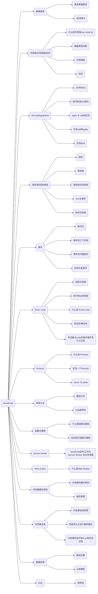
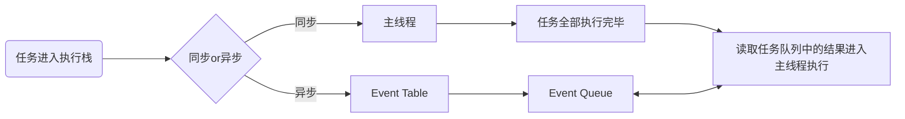

# JavaScript



## 1. 数据类型

javascript 的数据类型、数据检查、深浅拷贝，是 js 最基础的内容

### 1.1 基本数据类型

基本数据类型都是一些简单的数据段，它们是存储在栈内存中

- string
- number
- boolean
- undefined
- null
- Symbol
- bigInt

### 1.2 引用数据类型

引用数据类型是保存在堆内存中的，然后再栈内存中保存一个对堆内存中实际对象的引用。所以，`JavaScript 中对引用数据类型的操作都是操作对象的引用而不是实际的对象`

- Array
- Object

### 1.3 为什么基础数据类型存在栈中，而引用数据类型存在堆中呢

- 堆比栈大，栈比堆速度快。
- 基础数据类型比较稳定，而且相对来说占用的内存小。
- 引用数据类型大小是动态的，而且是无限的。
- 堆内存是无序存储，可以根据引用直接获取。

### 1.4 浅拷贝与深拷贝

- 浅拷贝
  - 浅拷贝的意思就是只复制引用，而未复制真正的值
- 深拷贝

  - 深拷贝就是对目标的完全拷贝，不像浅拷贝那样只是复制了一层引用，就连值也都复制了
  - JSON.stringify/parse 方法

  ```js
  function DeepClone2(obj) {
    let _obj = JSON.stringify(obj);
    let objClone = JSON.parse(_obj);
    return objClone;
    // 存在一些问题
    // 1.无法拷贝undefined、function、Symbol
    // 2.如果对象中有时间对象，则JSON.stringify后再 parse的结果，时间将只是字符串形式，而不是对象形式
    // 3.对象中有正则、Error对象、则序列化的结果将只能得到空对象
    // 4.对象中有NaN、Infinity，序列化后会变成null
    // 5.JSON。stringify 只能序列化对象的可枚举的自有属性，如果对象中的对象是由构造函数生成的，会丢弃constructor
  }
  ```

  - 递归实现深拷贝

  ```js
  function deepClone(obj) {
    if (typeof obj !== "object" || obj == null) {
      return obj;
    }

    // 初始化返回值
    let result = Array.isArray(obj) ? [] : {};

    for (let key in obj) {
      if (obj.hasOwnProperty(key)) {
        // 保证key不是原型的属性
        //递归
        result[key] = deepClone(obj[key]);
      }
    }
    return result;
  }
  ```

## 2. 作用域

### 2.1 执行上下文的理解

简而言之，`执行上下文是评估和执行 JavaScript 代码环境的抽象概念`。每当 Javascript 代码在运行的时候，它都是在执行上下文中运行

### 2.2 执行上下文的类型

JS 有三种类型的执行上下文

- 全局执行上下文 --- 是默认或者基础的上下文，任何不在函数内部的代码都会在全局上下文中。`它会执行两件事：创建一个全局的 window 对象（浏览器情况下），并且设置 this 的值等于这个全局变量。一个程序中只会有一个全局执行上下文`

- 函数执行上下文 --- `每当一个函数被调用时都会为该函数创建一个新的上下文`。每个函数都有它自己的执行上下文，不过是在函数被调用时创建的。函数上下文可以有任意多个。每当一个新的执行上下文被创建，它会按定义的顺序执行一系列步骤。

- Eval 函数执行上下文 --- 执行在 eval 函数内部的代码也会有自己的执行上下文。

### 2.3 执行栈

- 执行栈，也就是在其它编程语言中所说的“调用栈”，`是一种拥有 LIFO（后进先出）数据结构的栈，被用来存储代码运行时创建的所有执行上下文`。

- 当 JavaScript 引擎第一次遇到脚本时，他会创建一个全局的执行上下文并且压入当前执行栈。`每当引擎遇到一个函数调用，他会为该函数创建一个新的执行上下文并压入栈的顶部`.

- 引擎会执行那些执行上下文位于栈顶的函数.每当函数执行结束之后，最上层的执行上下文从栈中弹出，控制流程到达当前栈中的下一个上下文

- 一旦所有代码执行完毕，JavaScript 引擎从当前栈中移除全局执行上下文

### 2.4 怎样创建执行上下文

- 有两个阶段

  1. 创建阶段
  2. 执行阶段

- 创建阶段

  - 在 JavaScript 代码执行前，执行上下文将经历创建阶段。在创建阶段将会发生三件事

    - `this` 值的绑定
    - 创建词法环境
    - 创建变量环境

  - this 绑定

    - 在全局执行上下文中,`this` 的值指向全局对象(在浏览器中,全局对象为 `window`)
    - 在函数执行上下文中,`this` 的值取决于该函数是如何被调用的.如果他被一个引用类型对象调用,那么 `this` 会被设置成那个对象,否则 `this` 的值被设置成全局对象或者 `undefined`(严格模式)

  - 词法环境

    - 词法环境是一种规范类型，基于 ECMAScript 代码的词法嵌套结构来定义标识符和具体变量和函数的关联。一个词法环境由环境记录器和一个可能的引用外部词法环境的空值组成。
    - 简单来说词法环境是一种持有标识符—变量映射的结构

  - 变量环境

    - 量环境其实也是一个词法环境,其环境记录器中持有变量声明语句在执行上下文中创建的绑定关系

    - 变量环境有着词法环境的所有属性

    - 在 ES6 中,词法环境组件和变量环境的一个不同就是前者被用来存储函数声明和变量(`let` 和 `const`)绑定,而后者只用来存储 `var` 变量绑定

- 执行阶段
  - 在此阶段完成对所有存储的变量的分配，最后执行代码

### 2.5 作用域

- 什么是作用域

  - 作用域是指代码中定义变量的区域，即变量和函数生效的区域或集合。作用域规定了如何查找变量，也就是确定当前执行代码对变量的访问权限，决定了代码区块中变量和其他资源的可见性。

  - 编译过程中，负责收集并维护所有声明的标志符（变量），确定当前执行代码对这些标志符的访问权限的一套规则。

- 全局作用域

  - 最外层函数和在最外层函数之外定义的变量拥有全局作用域
  - 所有未定义直接赋值的变量默认为全局变量，拥有全局作用域
  - 所有 window 对象的属性拥有全局作用域
  - 容易引发命名冲突，污染全局命名空间

- 函数作用域

  - 在函数内部声明的变量拥有函数作用域，一般只能在固定的代码片段内访问到

- 块级作用域

  - 块级作用域可以通过 let、const 声明，所声明的变量在指定块级作用域外无法被访问
  - 块级作用域在如下情况下被创建
    - 在一个函数内部
    - 在一个代码块内部（`‘{}’`）

- 块级作用域有以下几个特点
  - 声明变量不会提升到代码块顶部（let / const 实际上是存在变量提升的，但是由于暂时性死区的存在使 let / const 不能在声明之前被调用）
  - 禁止重复声明

### 2.6 作用域链

在 JavaScript 中,函数、块、模块都可以形成作用域,他们之间可以相互嵌套、作用域之间会形成引用关系，这条链叫做作用域链

#### 作用域链的创建和变化

- 函数创建时

  - JavaScript 中使用的是词法作用域,函数的作用域在函数定义的时候就已经决定了
  - 函数有一个内部属性`[[scope]]`，当函数创建的时候,就会保存所有父变量对象到其中,可以理解为`[[scope]]`就是所有父变量对象的层级链,但是注意:`[[scope]]`并不代表完整的作用域链

- 函数被激活时
  - 当函数被激活时,进入函数上下文,创建 VO/AO 后就会将活动对象添加到作用域的前端，
    这时候执行上下文的作用域链,我们命名为 Scope

### 2.7 闭包

#### 2.7.1 什么是闭包

- 闭包就是同时含有对函数对象以及作用域对象引用的对象,实际上所有 JavaScript 对象都是闭包.闭包就是能够读取其他函数内部变量的函数, 闭包允许函数访问并操作函数外部的变量

- from MDN：一个函数和对其周围状态（lexical environment，词法环境）的引用捆绑在一起（或者说函数被引用包围），这样的组合就是闭包（closure）。也就是说，闭包让你可以在一个内层函数中访问到其外层函数的作用域。在 JavaScript 中，每当创建一个函数，闭包就会在函数创建的同时被创建出来

- 本质：在一个函数内部存在对外部作用域的引用

- 特性
  - 函数嵌套函数
  - 函数内部引用函数外部的参数和变量
  - 参数和变量不会被垃圾回收机制回收

#### 2.7.2 闭包是什么时候被创建 / 销毁的

- 因为所有 JavaScript 对象都是闭包，所以当定义一个函数时，就产生了闭包
- 当他不被任何其他的对象引用的时候，闭包就被销毁

#### 2.7.3 闭包的优缺点

- 优点

  - 保护函数内的变量安全，实现封装，防止变量流入其他环境发生命名冲突
  - 在内存中维持一个变量，延长变量的生命周期
  - 匿名自执行函数可以减少内存消耗

- 缺点

  - 被引用的私有变量不能被销毁，增加了内存损耗，可能造成内存泄露
  - 闭包涉及跨域访问，会导致性能损失

- 作用

  - 使得函数内部的变量在函数执行完成后，仍然存在与内存中
  - 让函数外部可以操作函数内部数据

- 原理

  - 当一个函数返回后，没有其他对象会保存对其的引用。所以，它就可能被垃圾回收器回收。

  - 函数对象中总是有一个`[[scope]]`属性，保存着该函数被定义的时候所能够直接访问的作用域对象。所以，当我们在定义嵌套的函数的时候，这个嵌套的函数的`[[scope]]`就会引用外围函数（Outer function）的当前作用域对象。

  - 如果我们将这个嵌套函数返回,并被另一个标识符所引用的话,那么这个嵌套函数及其`[[scope]]`所引用的作用作用域对象就不会被垃圾回收器所销毁,这个对象就会一直存活在内存中,我们可以通过这个作用于对象获取到外部函数的属性和值。

## 3. 原型

### 3.1 构造函数

#### 3.1.1 什么是构造函数

- `constructor` 返回创建实例对象时构造函数的引用。此属性的值是对函数本身的引用，而不是一个包含函数名称的字符串。

- 构造函数本身就是一个函数，与普通函数没有任何区别，不过为了规范一般将其首字母大写。构造函数和普通函数的区别在于，使用 `new` 生成实例的函数就是构造函数，直接调用的就是普通函数。

#### 3.1.2 Symbol 是构造函数吗

- `Symbol` 是基本数据类型，但作为构造函数来说它并不完整，因为它不支持语法 new `Symbol()`，Chrome 认为其不是构造函数，如果要生成实例直接使用 `Symbol()` 即可。

- 虽然是基本数据类型，但 `Symbol(123)` 实例可以获取 `constructor` 属性值。

- 其实是 `Symbol` 原型上的，即 `Symbol.prototype.constructor` 返回创建实例原型的函数， 默认为 `Symbol` 函数

#### 3.1.3 constructor 值只读吗

- 对于引用类型来说，`constructor` 属性值可以修改，但对于基本类型就是只读的。

### 3.2 原型 prototype

- JavaScript 是一种`基于原型的语言`，每一个对象拥有一个原型对象，对象以原型为模板，从原型继承属性和方法，这些属性和方法定义在对象的构造器函数的 `prototype` 属性上，而非实例本身上。

- 原型对象就是指函数所拥有的 `prototype` 属性所指向的对象

### 3.3 原型链

- 每个对象拥有一个原型对象，通过 `__proto__` 指针指向上一个原型 ，并从中继承方法和属性，同时原型对象也可能拥有原型，这样一层一层，最终指向 `null`。这种关系被称为原型链 (prototype chain)，通过原型链一个对象会拥有定义在其他对象中的属性和方法。


### 3.4 创建对象的多种方法以及优缺点

### 3.5 使用构造函数创建对象的过程

- 使用 new 操作符调用函数

  - 创建一个新对象
  - 将构造函数的作用域赋给新对象，即把`this`指向新对象
  - 将新对象的`__proto__`属性指向构造函数的`ptototype`属性
  - 执行函数内代码，为新对象添加属性
  - 返回新的对象（默认返回`this`，`this`就是新对象）

### 3.6 继承方法

```js
// 第一种：原型链继承
// 弊端：原型链继承，当原型中存在引用类型值时，示例可以修改其值
function A() {}
A.prototype.getName = function () {};
function B() {}
B.prototype = new A();
B.prototype.constructor = B;

// 第二种：修改构造函数this指向
// 弊端：只能继承父对象的实例属性和方法，不能继承父对象原型属性和方法
// 无法实现函数复用
function A() {}
A.prototype.getName = function () {};
function B() {
  A.call(this);
}
B.prototype.say = function () {};

// 第三种：组合继承
// 缺点：父类构造函数会被调用两次

function A() {}
A.prototype.getName = function () {};

function B() {
  A.call(this);
}
B.prototype = new A();
B.prototype.constructor = B;

//  第四种 寄生式组合继承
function A() {}
A.prototype.getName = function () {};

function B() {
  A.apply(this, arguments);
}
B.prototype = Object.create(A.prototype);
B.prototype.constructor = B;

// 第五种 class ES6
class A {
  constructor(name) {
    this.name = name;
  }
}

class B {
  constructor(name, age) {
    super(name);
    this.age = age;
  }
}
```

## 4. this

### 4.1 普通函数中的this

### 4.2 构造函数的 this

- 使用 `new` 操作符时，`this` 指向生成的新对象（`new` 调用时的返回值，如果没有显式返回对象或者函数，才是返回生成的新对象）

### 4.3 对象中的函数this

### 4.4 原型链中的 this

-

### 4.5 call、apply、bind 调用模式

### 4.6 箭头函数中的 this

### 实现 call、apply、bind

```JS
Function.prototype.customBind = function () {
  if (typeof this !== 'function') {
    return false
  }
  // 拆解参数
  const args = Array.prototype.slice.call(arguments)

  // 获取this
  const customThis = args.shift()

  const res = this

  return () => res.apply(customThis, args)
}

Function.prototype.myCall = function () {
  if (typeof this !== 'function') {
    return false
  }
  let args = [...arguments]
  let _this = args.shift(1)
  _this.fn = this
  let res = _this.fn(...args)
  delete _this.fn
  return res
}

Function.prototype.myApply = function () {
  if (typeof this !== 'function') {
    return false
  }
  let args = [...arguments]
  let _this = args.shift(1)
  _this.fn = this
  let res = _this.fn(args)
  delete _this.fn
  return res 
}
```

## 5. 事件

### 5.1 事件流

#### 5.1.1 什么是事件

- JavaScript 和 HTML 之间的交互是通过事件实现的。事件就是文档或浏览器窗口发生的一些特定的交互瞬间。可以使用监听器（或事件处理程序）来预定事件，以便事件发生时执行相应的代码。通俗的说，这种模型其实是一个观察者模式。

#### 5.1.2 什么是事件流

- 事件流描述的就是从页面接收事件的顺序。早期的IE 和 Netscape 提出了相反的事件流概念，IE事件流是事件冒泡，而Netscape的事件流就是事件捕获。
- 事件冒泡，即从下至上，从目标出大的元素逐级向上传播，知道window对象
- 而事件捕获，即从document逐级向下传播到目标元素。

### 5.2 事件的三个阶段

- DOM2级事件规定的事件流包括三个阶段
  - 事件捕获阶段
  - 处于目标阶段
  - 事件冒泡阶段

### 5.3 事件的代理委托

- DOM事件处理分为4个级别：DOM0级事件处理、DOM1级事件处理、DOM2级事件处理、DOM3级事件处理。

#### 5.3.1 DOM0

- DOM0级事件具有极好的跨浏览器优势，会以最快的速度绑定。
  - 第一种方式是内联模型（行内绑定），将函数名直接作为html标签中属性的属性值。内联模型缺点是不符合内容与行为分离的规范。

  ```HTML
  <div onclick="btnClick()">click</div>
  <script>
    function btnClick() {
      console.log('hello')
    }
  </script>
  ```

  - 第二种方式是脚本模型（动态绑定），选中某个节点，然后添加onclick属性。缺点是同一节点只能添加一次同类型事件。

  ```HTML
  <div id="btn">点击</div>
  <script>
  var btn=document.getElementById("btn");
  btn.onclick=function(){
      console.log("hello");
  }
  </script>
  ```

  - DOM0级只支持冒泡阶段

#### 5.3.2 DOM2

- 进一步规范之后，有了DOM2级事件处理程序，其中定义了两个方法
  - `addEventListener()` -- 添加事件侦听器
  - `removeEventListener()` -- 删除事件侦听器
- 函数均有三个参数，第一个参数是要处理的事件类型，第二个参数是作为事件处理程序的函数，第三个参数是一个`boolean`值，默认`false`表示使用冒泡机制，`true`表示捕获机制。
- 如果定义了一模一样的监听方法，会发生覆盖，即同样的事件和事件流机制下相同的方法只会触发一次
- 阻止冒泡
  - `stopPropagation`

### 5.4 事件委托

- 如果有多个DOM节点需要监听事件的情况下，给每个DOM绑定监听函数，会极大地影响页面的性能，可以使用事件委托来进行优化，事件委托就是利用了事件冒泡的原理
- 优点
  - 提高性能：每一个函数都会占用内存空间，只需要添加一个事件处理程序代理所有事件，所占用的内存空间会更少
  - 动态监听：使用事件委托可以自动绑定动态添加的元素，即新增的节点不需要主动添加也可以有和其他元素一样的事件
  - `e.target` 触发事件的元素
  - `e.currentTarget` 绑定事件的元素

## 6. Event Loop

- Event Loop 就是事件循环，可以理解为实现异步的一种方式

### 6.1 进程与线程

- 概念
  - 线程是进程中执行运算的最小单位，是进程中的一个实体，是被系统独立调度和分派的基本单位，线程自己不拥有系统资源，只拥有一点在运行中必不可少的资源，但它可与同属一个进程的其它线程共享进程所拥有的全部资源。一个线程可以创建和撤消另一个线程，同一进程中的多个线程之间可以并发执行。
- 优点
  - 易于调度
  - 提高并发性，通过线程可方便有效地实现并发性。进程可创建多个线程来执行同一程序的不同部分。
  - 开销少。创建线程比创建进程要快，所需开销很少。
  - 利于充分发挥多处理器的功能。通过创建多线程进程，每个线程在一个处理器上运行，从而实现应用程序的并发性，使每个处理器都得到充分运行。

- 线程与进程的关系与区别
  - 关系
    - 一个线程只能属于一个进程，而一个进程可以有多个线程，但至少有一个线程。
    - 资源分配给进程，同一进程的所有线程共享该进程的所有资源。
    - 处理机分给线程，即真正在处理机上运行的是线程。
    - 线程在执行过程中，需要协作同步。不同进程的线程间要利用消息通信的办法实现同步。线程是指进程内的一个执行单元,也是进程内的可调度实体.
  - 区别
    - 调度：线程作为调度和分配的基本单位，进程作为拥有资源的基本单位
    - 并发性：不仅进程之间可以并发执行，同一个进程的多个线程之间也可并发执行
    - 拥有资源：进程是拥有资源的一个独立单位，线程不拥有系统资源，但可以访问隶属于进程的资源.
    - 系统开销：在创建或撤消进程时，由于系统都要为之分配和回收资源，导致系统的开销明显大于创建或撤消线程时的开销。

### 6.2 JS为什么是单线程

- javaScript的单线程，与它的用途有关。作为浏览器脚本语言，JavaScript的主要用途是与用户互动，以及操作DOM。这决定了它只能是单线程，否则会带来很复杂的同步问题。比如，假定JavaScript同时有两个线程，一个线程在某个DOM节点上添加内容，另一个线程删除了这个节点，这时浏览器应该以哪个线程为准

### 6.3 微任务/宏任务

- 一个`event loop`有一个或者多个`task`队列，当用户代理安排一个任务，必须将该任务增加到相应的event loop的一个task队列中

#### 6.3.1 task

task 也被称为 macrotask，是一个先进先出的队列，由指定的任务源去提供任务

- 哪些是 task 任务源
  - DOM操作任务源
  - 用户交互任务源
  - 网络任务源
  - history traversal 任务源
  - 总结来说
    - setTimeout
    - setInterval
    - setImmediate
    - I/O
    - UI rendering

#### 6.3.2 microtask

每一个event loop都有一个microtask队列，与task队列有些相似，都是先进先出，由指定的任务源去提供任务，不同的是一个event loop中只有一个 microtask

- 通常认为的microtask任务源
  - process.nextTick
  - Promise
  - Object.observe
  - MutationObserver

### 6.4 调用栈（执行栈）

- JS有一个 main thread 主线程和 call stack 调用栈，所有任务都会被放到调用栈等待主线程执行。调用栈采用的是后进先出的规则，当函数执行时，会被添加到站的顶部，当执行栈执行完毕后，就会被从栈顶移出，直到栈内被清空。
- JS 中的执行栈就具有这样的结构，当引擎第一次遇到 JS 代码时，会产生一个全局执行上下文并压入执行栈，每遇到一个函数调用，就会往栈中压入一个新的上下文。引擎执行栈顶的函数，执行完毕，弹出当前执行上下文。

### 6.5 同步任务和异步任务

- JavaScript 单线程任务被分为同步任务和异步任务，同步任务会在调用栈中按照顺序等待主线程依次执行，异步任务会在异步任务有了结果之后，将注册的回调函数放入任务队列中等待主线程空闲的时候（调用栈清空），被读取到栈内等待主线程的执行。

- 任务队列 Task Queue，是一种先进先出的数据结构



- 执行栈在执行完同步任务后，查看执行栈是否为空，如果执行栈为空，就会去检查微任务队列是否为空，如果不为空的话，会按照先进先出的规则全部执行完为任务后，设置微任务队列为null，然后再执行宏任务，如此循环。

### 6.6 浏览器与node事件循环的区别

#### 6.6.1 浏览器内核

- 简单来说浏览器内核是通过取得页面内容、整理信息（应用 CSS）、计算和组合最终输出可视化的图像结果，通常也被称为渲染引擎。浏览器内核是多线程，在内核控制下各线程相互配合以保持同步，一个浏览器通常由以下常驻线程组成：
- 一个浏览器通常由一下常驻线程组成
  - GUI渲染线程
    - 负责页面的渲染，解析html，css，构建dom树，布局，绘制等。当界面需要重绘或者触发回流时，执行该线程
    - 与 js 引擎线程互斥，js引擎线程执行时，GUI渲染会被挂起，当任务队列空闲时，js引擎才会去执行GUI渲染
  - JavaScript 引擎线程
    - 主要负责处理js脚本，执行代码
  - 定时触发器线程
    - 负责 setTimeout、setInterval
  - 事件触发线程
    - 负责将准备好的事件交给js引擎线程执行，如回调函数等
  - 异步 http 请求线程
    - 负责执行异步请求一类的函数的线程，如 Promise、axios等
    - 主线程依次执行代码时，遇到异步请求，会将函数交给该线程处理，当监听到状态码变更，如果有回调函数，事件触发线程会将回调函数加入到任务队列尾部，等待js引擎线程执行。

#### 6.6.2 浏览器中的event Loop

- Micro Task 和 Macro task
  - 事件循环中的异步队列有两种：macro（宏任务）队列和 micro（微任务）队列。宏任务队列可以有多个，微任务队列只有一个。
  - 常见的 macro-task 比如：setTimeout、setInterval、 setImmediate、script（整体代码）、 I/O 操作、UI 渲染等。
  - 常见的 micro-task 比如: process.nextTick、new Promise().then(回调)、MutationObserver(html5 新特性) 等。

- Event Loop 过程解析
  - 一个完整的 Event Loop 过程，可以概括为以下阶段

  ```mermaid
  flowchart LR
    s1(任务进入执行栈) --> s2(执行栈) --> s3(同步or异步)
    s3 --> |sync|s4(压入栈立即执行)
    s3 --> |async|s5(异步处理模块)
    s4 --> s6(执行完毕出栈) --> s7(任务执行完毕->栈为空) --> s8(依次读取任务队列中的任务->压入栈->执行完毕出栈)
    s5 --> |注册回调函数|s9(任务队列)
    s9 <--> s8
  ```

  - 一开始执行栈空,我们可以把执行栈认为是一个存储函数调用的栈结构，遵循先进后出的原则。micro 队列空，macro 队列里有且只有一个 script 脚本（整体代码）。
  - 全局上下文（script 标签）被推入执行栈，同步代码执行。在执行的过程中，会判断是同步任务还是异步任务，通过对一些接口的调用，可以产生新的 macro-task 与 micro-task，它们会分别被推入各自的任务队列里。同步代码执行完了，script 脚本会被移出 macro 队列，这个过程本质上是队列的 macro-task 的执行和出队的过程。
  - 上一步我们出队的是一个 macro-task，这一步我们处理的是 micro-task。但需要注意的是：当 macro-task 出队时，任务是一个一个执行的；而 micro-task 出队时，任务是一队一队执行的。因此，我们处理 micro 队列这一步，会逐个执行队列中的任务并把它出队，直到队列被清空。
  - 执行渲染操作，更新界面
  - 检查是否存在 Web worker 任务，如果有，则对其进行处理
  - 上述过程循环往复，直到两个队列都清空

#### 6.6.3 Node 中的 Event Loop

- Node 中的 Event Loop 和浏览器中的是完全不相同的东西。Node.js 采用 V8 作为 js 的解析引擎，而 I/O 处理方面使用了自己设计的 libuv，libuv 是一个基于事件驱动的跨平台抽象层，封装了不同操作系统一些底层特性，对外提供统一的 API，事件循环机制也是它里面的实现

- 有六个阶段
  - timers 阶段：这个阶段执行 timer（setTimeout、setInterval）的回调
  - I/O callbacks 阶段：处理一些上一轮循环中的少数未执行的 I/O 回调
  - idle, prepare 阶段：仅 node 内部使用
  - poll 阶段：获取新的 I/O 事件, 适当的条件下 node 将阻塞在这里
  - check 阶段：执行 setImmediate() 的回调
  - close callbacks 阶段：执行 socket 的 close 事件回调
