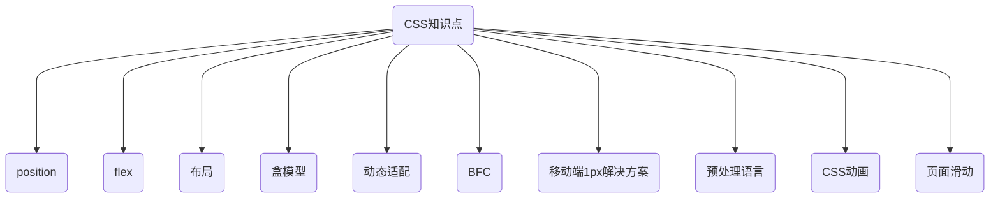

# CSS



## 1. 盒模型

- 是什么
  - 当对一个文档进行布局的时候，浏览器的渲染引擎会根据标准之一的 CSS 基础盒模型，将所有元素表示为一个个矩形的盒子。
  - 一个盒子由四个部分组成：content、padding、border、margin
- 标准盒模型
  - 盒子总宽度：width + padding + border + margin
  - 盒子总高度：height + padding + border + margin
- IE 怪异盒子模型
  - 盒子总宽度：width + margin
  - 盒子总高度：height + margin

- 块级盒子

  - 盒子会在内联的方向上扩展并占据父容器在该方向上的所有可用空间，在绝大数情况下意味着盒子会和父容器一样宽
  - 每个盒子都会换行
  - width 和 height 属性可以发挥作用
  - 内边距（padding）, 外边距（margin） 和 边框（border） 会将其他元素从当前盒子周围“推开”

- 内联盒子
  - 盒子不会产生换行。
  - width 和 height 属性将不起作用。
  - 垂直方向的内边距、外边距以及边框会被应用但是不会把其他处于 inline 状态的盒子推开。
  - 水平方向的内边距、外边距以及边框会被应用且会把其他处于 inline 状态的盒子推开。

## 2. position

### 2.1 position 类型

- static
  - 该关键字指定元素使用正常的布局行为，即元素在文档常规流中当前的布局位置。此时 top, right, bottom, left 和 z-index 属性无效。
- relative
  - 该关键字下，元素先放置在未添加定位时的位置，再在不改变页面布局的前提下调整元素位置（因此会在此元素未添加定位时所在位置留下空白）
- absolute
  - 元素会被移出正常文档流，并不为元素预留空间，通过指定元素相对于最近的非 static 定位祖先元素的偏移，来确定元素位置。绝对定位的元素可以设置外边距（margins），且不会与其他边距合并。
- fixed
  - 元素会被移出正常文档流，并不为元素预留空间，而是通过指定元素相对于屏幕视口（viewport）的位置来指定元素位置。元素的位置在屏幕滚动时不会改变。打印时，元素会出现在的每页的固定位置。
- sticky
  - 元素根据正常文档流进行定位，然后相对它的最近滚动祖先（nearest scrolling ancestor）和 containing block (最近块级祖先 nearest block-level ancestor)，包括 table-related 元素，基于 top, right, bottom, 和 left 的值进行偏移。偏移值不会影响任何其他元素的位置。

### 2.2 定位

- 相对定位
  - 相对定位的元素是在文档中的正常位置偏移给定的值，但是不影响其他元素的偏移。
- 绝对定位
  - 相对定位的元素并未脱离文档流，而绝对定位的元素则脱离了文档流。在布置文档流中其它元素时，绝对定位元素不占据空间。绝对定位元素相对于最近的非 static 祖先元素定位。当这样的祖先元素不存在时，则相对于 ICB（initial container block, 初始包含块）
- 固定定位
  - 固定定位与绝对定位相似，但元素的包含块为 viewport 视口。该定位方式常用于创建在滚动屏幕时仍固定在相同位置的元素。
- 粘性定位
  - 粘性定位可以被认为是相对定位和固定定位的混合。元素在跨越特定阈值前为相对定位，之后为固定定位

## 3. flex

### 3.1 什么是 Flex 布局

- Flex 是 Flexible Box 的缩写，意为”弹性布局”，用来为盒状模型提供最大的灵活性。
- 设为 Flex 布局以后，子元素的 float、clear 和 vertical-align 属性将失效。

### 3.2 基本概念

- 采用 Flex 布局的元素，称为 Flex 容器（flex container），简称”容器”。它的所有子元素自动成为容器成员，称为 Flex 项目（flex item），简称”项目”。
- 容器默认存在两根轴：水平的主轴（main axis）和垂直的交叉轴（cross axis）。主轴的开始位置（与边框的交叉点）叫做 main start，结束位置叫做 main end；交叉轴的开始位置叫做 cross start，结束位置叫做 cross end。

- 项目默认沿主轴排列。单个项目占据的主轴空间叫做 main size，占据的交叉轴空间叫做 cross size。

### 3.3 容器属性

- flex-direction

  - flex-direction: 决定主轴的方向 (即项目的排列方向)
  - row(默认值): 主轴为水平方向, 起点在左端;
  - row-reverse: 主轴在水平方向, 起点在右端;
  - column: 主轴为垂直方向, 起点在上沿
  - column-reverse 主轴为垂直方向, 起点在下沿; 与 column 相同, 但是以相反的顺序 。
  - initial 关键字用于设置 CSS 属性为它的默认值; initial 关键字可用于任何 HTML 元素上的任何 CSS 属性
  - inherit 从父元素继承该属性

- flex-wrap: 如果一条轴线排不下, 如何换行

  - nowrap 默认: 不换行 。 当容器宽度不够时, 每个项目会被挤压宽度 。
  - wrap 换行: 并且第一行在容器最上方
  - wrap-reverse 换行: 并且第一行在容器最下方

- justify-content: 定义了项目在主轴上的对齐方式

  - 此属性与主轴方向息息相关
  - 主轴方向为: row-起点在左边, row-reverse-起点在右边, column-起点在上边, column-reverse-起点在下边
    - flex-start (默认值): 项目位于主轴起点
    - flex-end: 项目位于主轴终点
    - center: 居中
    - space-between: 两端对齐, 项目之间的间隔都相等 (开头和最后的项目, 与父容器边缘没有间隔) 。
    - space-around: 每个项目两侧的间隔相等

- align-items: 定义项目在交叉轴上如何对齐

  - stretch 默认值: 如果项目 未设置高度 或 设为 auto, 将占满整个容器的高度。
  - flex-start: 交叉轴的起点对齐
  - flex-end: 交叉轴的终点对齐
  - center: 交叉轴的中点对齐
  - baseline: 项目的第一行文字的基线对齐 (文字的行高、字体大小会影响每行的基线)

- align-content: 定义了多根轴线的对齐方式
  - stretch(默认值): 轴线占满整个交叉轴
  - flex-start: 与交叉轴的起点对齐
  - flex-end: 与交叉轴的终点对齐
  - center: 与交叉轴的中点对齐
  - space-between: 与交叉轴两端对齐, 轴线之间的间隔平均分布 。
  - space-around: 每根轴线两侧的间隔都相等。 所以, 轴线之间的间隔比轴线与边框的间隔大一倍

### 3.4 项目属性

- order - 项目的排列顺序
- flex-grow - 定义项目的放大比例
- flex-shrink - 定义了项目的缩小比例
- flex-basis - 定义了在分配多余空间之前，项目占据的主轴空间（main size）
- flex - 是 flex-grow, flex-shrink 和 flex-basis 的简写，默认值为 0 1 auto
- align-self - 允许单个项目有与其他项目不一样的对齐方式

## 4. BFC（Block Formatting Context）

### 4.1 BFC 定义

- BFC(Block formatting context)直译为"块级格式化上下文"。它是一个独立的渲染区域，只有 Block-level box 参与， 它规定了内部的 Block-level Box 如何布局，并且与这个区域外部毫不相干。
- BFC 是一个独立的布局环境，其中的元素布局是不受外界的影响，并且在一个 BFC 中，块盒与行盒（行盒由一行中所有的内联元素所组成）都会垂直的沿着其父元素的边框排列。

### 4.2 BFC 布局规则

- 内部的 Box 会在垂直方向，一个接一个地放置。

- Box 垂直方向的距离由 margin 决定。属于同一个 BFC 的两个相邻 Box 的 margin 会发生重叠。

- 每个盒子（块盒与行盒）的 margin box 的左边，与包含块 border box 的左边相接触(对于从左往右的格式化，否则相反)。即使存在浮动也是如此。

- BFC 的区域不会与 float box 重叠。

- BFC 就是页面上的一个隔离的独立容器，容器里面的子元素不会影响到外面的元素。反之也如此。

- 计算 BFC 高度时，浮动元素也参与计算

### 4.3 如何创建 BFC

- 根元素，即 html
- float 不是 none
- position 是 absolute 或 fixed
- overflow 不是 visible
- display 是 flex inline-block 等
- BFC 的常见作用
  - 利用 BFC 避免 margin 重叠
  - 自适应两栏布局
  - 清除浮动

## 5. CSS3 动画

### 5.1 transform

- `transform`可以用来设置元素的形状改变，主要有以下几种变形：`rotate`（旋转）、`scale`（缩放）、`skew`（扭曲）、`translate`（移动）和 `matrix`（矩阵变形）

```css
.transform-class {
  transform ： none | <transform-function> [ <transform-function> ]*
}
```

- `none`表示不做变换；`<transform-function>`表示一个或多个变化函数，变化函数由函数名和参数组成，参数包含在()里面，用空格分开，例如：

```CSS
.transform-class {
  transform ： rotate(30deg) scale(2,3);
}
```

- transform-origin 基点
  - 所有的变形都是基于基点，基点默认为元素的中心点

  ```CSS
  .transform-class {
    transform-origin: (left, bottom);
  }
  ```

- rotate
  - 表示通过指定的角度对元素进行旋转变形，如果是正数则顺时针旋转，如果是负数则逆时针旋转

  ```CSS
  .transform-rotate {
    transform: rotate(30deg);
  }
  ```

- scale
  - 它有三种用法：`scale(<number>[, <number>])`、`scaleX(<number>)`和`scaleY(<number>)`；分别代表水平和垂直方向同时缩放、水平方向的缩放以及垂直方向的缩放，入参代表水平或者垂直方向的缩放比例

  ```CSS
  .transform-scale {
    transform: scale(2,1.5);
  }

  .transform-scaleX {
    transform: scaleX(2);
  }

  .transform-scaleY {
    transform: scaleY(1.5);
  }
  ```

- translate
  - 移动也分三种情况：`translate(<translation-value>[, <translation-value>])`、`translateX(<translation-value>)`和`translateY(<translation-value>)`；分别代表水平和垂直的移动、水平方向的移动以及垂直方向同时移动，移动单位是 CSS 中的长度单位：px、rem等

  ```CSS
  .transform-translate {
    transform: translate(400px, 20px);
  }

  .transform-translateX {
    transform: translateX(300px);
  }

  .transform-translateY {
    transform: translateY(20px);
  }
  ```

- skew
  - 扭曲同样也有三种情况，`skew(<angle>[, <angle>])`、`skewX(<angle>)`和`skewY(<angle>)`；同样也是水平和垂直方向同时扭曲、水平方向的扭曲以及垂直方向的扭曲，单位为角度

  ```CSS
  .transform-skew {
    transform: skew(30deg, 10deg);
  }

  .transform-skewX {
    transform: skewX(30deg);
  }

  .transform-skewY {
    transform: skewY(10deg);
  }
  ```

- matrix

### 5.2 transition

- `transition`是用来设置样式的属性值是如何从从一种状态变平滑过渡到另外一种状态，它有四个属性：
  - transition-property（变换的属性，即那种形式的变换：大小、位置、扭曲等）；
  - transition-duration（变换延续的时间）；
  - transition-timing-function（变换的速率）
  - transition-delay（变换的延时）

### 5.3 animation

- @keyframes
- animation-name
- animation-duration
- animation-timing-function
- animation-delay
- animation-iteration-count
- animation-direction
- animation-play-state
- animation

### 5.4 移动端1px解决方案

- 采用meta viewport 的方式（只针对移动端）

```HTML
<meta name="viewport" content="width=device-width, initial-scale=0.5, minimum-scale=0.5, maximum-scale=0.5"/>
```

- 采用 transform：scale()

```CSS
transform: scale(0.5,0.5);
```

## 6. 预处理器

### 6.1 主要的几种预处理器

- Sass
- Less
- Stylus

### 6.2 优点

- 虽然各种预处理器功能强大，但使用最多的，还是以下特性
  - 变量（variables）
  - 代码混合（mixins）
  - 嵌套（nested rules）
  - 代码模块化（Modules）

### 6.3 缺点

- 额外的编译配置
- 编译成本
- 学习成本
- 调试

## 7. CSS3 新特性

### 7.1 新选择器

- :first-of-type
- :last-of-type
- :only-of-type
- :only-child
- :nth-child
- :nth-last-child
- :nth-of-type
- :last-child

### 7.2 新样式

- border-radius
- box-shadow
- border-image

### 7.3 背景

- background-clip
- background-origin
- background-size
- background-break

### 7.4 文字

- word-wrap
- text-overflow
- text-shadow
- text-decoration

### 7.5 颜色

- rgba
- hsla

### 7.6 transition

### 7.7 transform

### 7.8 animation

### 7.9 渐变

- linear-gradient
- radial-gradient

### 7.10 flex

### 7.11 grid

### 7.12 媒体查询

### 7.13 混合模式
