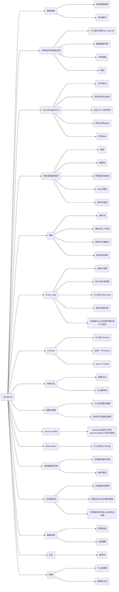
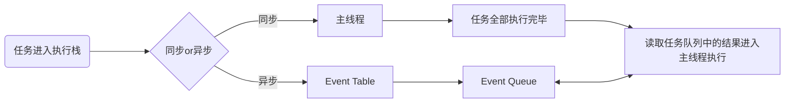

# JavaScript



## 1. 数据类型

javascript 的数据类型、数据检查、深浅拷贝，是 js 最基础的内容

### 1.1 基本数据类型

基本数据类型都是一些简单的数据段，它们是存储在栈内存中

- string
- number
- boolean
- undefined
- null
- Symbol
- bigInt

### 1.2 引用数据类型

引用数据类型是保存在堆内存中的，然后再栈内存中保存一个对堆内存中实际对象的引用。所以，`JavaScript 中对引用数据类型的操作都是操作对象的引用而不是实际的对象`

- Array
- Object
- Function

### 1.3 为什么基础数据类型存在栈中，而引用数据类型存在堆中呢

- 堆比栈大，栈比堆速度快。
- 基础数据类型比较稳定，而且相对来说占用的内存小。
- 引用数据类型大小是动态的，而且是无限的。
- 堆内存是无序存储，可以根据引用直接获取。

### 1.4 浅拷贝与深拷贝

- 浅拷贝
  - 浅拷贝的意思就是只复制引用，而未复制真正的值
- 深拷贝

  - 深拷贝就是对目标的完全拷贝，不像浅拷贝那样只是复制了一层引用，就连值也都复制了
  - JSON.stringify/parse 方法

  ```js
  function DeepClone2(obj) {
    let _obj = JSON.stringify(obj);
    let objClone = JSON.parse(_obj);
    return objClone;
    // 存在一些问题
    // 1.无法拷贝undefined、function、Symbol
    // 2.如果对象中有时间对象，则JSON.stringify后再 parse的结果，时间将只是字符串形式，而不是对象形式
    // 3.对象中有正则、Error对象、则序列化的结果将只能得到空对象
    // 4.对象中有NaN、Infinity，序列化后会变成null
    // 5.JSON。stringify 只能序列化对象的可枚举的自有属性，如果对象中的对象是由构造函数生成的，会丢弃constructor
  }
  ```

  - 递归实现深拷贝

  ```js
  function deepClone(obj) {
    if (typeof obj !== "object" || obj == null) {
      return obj;
    }

    // 初始化返回值
    let result = Array.isArray(obj) ? [] : {};

    for (let key in obj) {
      if (obj.hasOwnProperty(key)) {
        // 保证key不是原型的属性
        //递归
        result[key] = deepClone(obj[key]);
      }
    }
    return result;
  }
  ```

### 1.5 Tips

- 精度问题
  - 因为小数运算先将十进制转换为二进制数字，会出现一次精度丢失，而后计算后的二进制也会出现精度丢失，造成结果不准确
- Symbol 的作用
  - 表示一个独一无二的变量防止命名冲突
  - symbol 不可枚举，可以用来模拟私有变量
  - 提供遍历接口，symbol.iterator 的对象才能使用 for of 循环
  - symbol.for() 可以在全局访问 symbol
- falsely 变量
  - !!0 === false
  - !!NaN === false
  - !!'' === false
  - !! null === false
  - !! undefined === false
  - !! false === false

## 2. 作用域

### 2.1 执行上下文的理解

简而言之，`执行上下文是评估和执行 JavaScript 代码环境的抽象概念`。每当 Javascript 代码在运行的时候，它都是在执行上下文中运行

### 2.2 执行上下文的类型

JS 有三种类型的执行上下文

- 全局执行上下文 --- 是默认或者基础的上下文，任何不在函数内部的代码都会在全局上下文中。`它会执行两件事：创建一个全局的 window 对象（浏览器情况下），并且设置 this 的值等于这个全局变量。一个程序中只会有一个全局执行上下文`

- 函数执行上下文 --- `每当一个函数被调用时都会为该函数创建一个新的上下文`。每个函数都有它自己的执行上下文，不过是在函数被调用时创建的。函数上下文可以有任意多个。每当一个新的执行上下文被创建，它会按定义的顺序执行一系列步骤。

- Eval 函数执行上下文 --- 执行在 eval 函数内部的代码也会有自己的执行上下文。

### 2.3 执行栈

- 执行栈，也就是在其它编程语言中所说的“调用栈”，`是一种拥有 LIFO（后进先出）数据结构的栈，被用来存储代码运行时创建的所有执行上下文`。

- 当 JavaScript 引擎第一次遇到脚本时，他会创建一个全局的执行上下文并且压入当前执行栈。`每当引擎遇到一个函数调用，他会为该函数创建一个新的执行上下文并压入栈的顶部`.

- 引擎会执行那些执行上下文位于栈顶的函数.每当函数执行结束之后，最上层的执行上下文从栈中弹出，控制流程到达当前栈中的下一个上下文

- 一旦所有代码执行完毕，JavaScript 引擎从当前栈中移除全局执行上下文

### 2.4 怎样创建执行上下文

- 有两个阶段

  1. 创建阶段
  2. 执行阶段

- 创建阶段

  - 在 JavaScript 代码执行前，执行上下文将经历创建阶段。在创建阶段将会发生三件事

    - `this` 值的绑定
    - 创建词法环境
    - 创建变量环境

  - this 绑定

    - 在全局执行上下文中,`this` 的值指向全局对象(在浏览器中,全局对象为 `window`)
    - 在函数执行上下文中,`this` 的值取决于该函数是如何被调用的.如果他被一个引用类型对象调用,那么 `this` 会被设置成那个对象,否则 `this` 的值被设置成全局对象或者 `undefined`(严格模式)

  - 词法环境

    - 词法环境是一种规范类型，基于 ECMAScript 代码的词法嵌套结构来定义标识符和具体变量和函数的关联。一个词法环境由环境记录器和一个可能的引用外部词法环境的空值组成。
    - 简单来说词法环境是一种持有标识符—变量映射的结构

  - 变量环境

    - 变量环境其实也是一个词法环境,其环境记录器中持有变量声明语句在执行上下文中创建的绑定关系

    - 变量环境有着词法环境的所有属性

    - 在 ES6 中,词法环境组件和变量环境的一个不同就是前者被用来存储函数声明和变量(`let` 和 `const`)绑定,而后者只用来存储 `var` 变量绑定

- 执行阶段
  - 在此阶段完成对所有存储的变量的分配，最后执行代码

### 2.5 作用域

- 什么是作用域

  - 作用域是指代码中定义变量的区域，即变量和函数生效的区域或集合。作用域规定了如何查找变量，也就是确定当前执行代码对变量的访问权限，决定了代码区块中变量和其他资源的可见性。

  - 编译过程中，负责收集并维护所有声明的标志符（变量），确定当前执行代码对这些标志符的访问权限的一套规则。

- 全局作用域

  - 最外层函数和在最外层函数之外定义的变量拥有全局作用域
  - 所有未定义直接赋值的变量默认为全局变量，拥有全局作用域
  - 所有 window 对象的属性拥有全局作用域
  - 容易引发命名冲突，污染全局命名空间

- 函数作用域

  - 在函数内部声明的变量拥有函数作用域，一般只能在固定的代码片段内访问到

- 块级作用域

  - 块级作用域可以通过 let、const 声明，所声明的变量在指定块级作用域外无法被访问
  - 块级作用域在如下情况下被创建
    - 在一个代码块内部（`‘{}’`）

- 块级作用域有以下几个特点
  - 声明变量不会提升到代码块顶部（let / const 实际上是存在变量提升的，但是由于暂时性死区的存在使 let / const 不能在声明之前被调用）
  - 禁止重复声明

### 2.6 作用域链

- 在 JavaScript 中,函数、块、模块都可以形成作用域,他们之间可以相互嵌套、作用域之间会形成引用关系，这条链叫做作用域链
- 当在 Javascript 中使用一个变量的时候，首先 Javascript 引擎会尝试在当前作用域下去寻找该变量，如果没找到，再到它的上层作用域寻找，以此类推直到找到该变量或是已经到了全局作用域如果在全局作用域里仍然找不到该变量，它就会在全局范围内隐式声明该变量(非严格模式下)或是直接报错

#### 作用域链的创建和变化

- 函数创建时

  - JavaScript 中使用的是词法作用域,函数的作用域在函数定义的时候就已经决定了
  - 函数有一个内部属性`[[scope]]`，当函数创建的时候,就会保存所有父变量对象到其中,可以理解为`[[scope]]`就是所有父变量对象的层级链,但是注意:`[[scope]]`并不代表完整的作用域链

- 函数被激活时
  - 当函数被激活时,进入函数上下文,创建 VO/AO 后就会将活动对象添加到作用域的前端，
    这时候执行上下文的作用域链,我们命名为 Scope

#### Tips

- 预编译公式
  - 创建 GO/AO 对象
  - 找到形参和变量声明，将变量和形参作为 AO 属性名，值为 undefined
  - 将实参值和形参统一
  - 在函数体里面找到函数声明，值赋予函数体
  - 函数是一等公民，预编译过程中，变量重名，函数胜出

### 2.7 闭包

#### 2.7.1 什么是闭包

- 闭包就是同时含有对函数对象以及作用域对象引用的对象,实际上所有 JavaScript 对象都是闭包。闭包就是能够读取其他函数内部变量的函数, 闭包允许函数访问并操作函数外部的变量
- 从技术的角度讲，所有的JavaScript函数都是闭包：它们都是对象，它们都关联到作用域链。

- from MDN：一个函数和对其周围状态（lexical environment，词法环境）的引用捆绑在一起（或者说函数被引用包围），这样的组合就是闭包（closure）。也就是说，闭包让你可以在一个内层函数中访问到其外层函数的作用域。在 JavaScript 中，每当创建一个函数，闭包就会在函数创建的同时被创建出来

- 本质：在一个函数内部存在对外部作用域的引用

- 特性
  - 函数嵌套函数
  - 函数内部引用函数外部的参数和变量
  - 参数和变量不会被垃圾回收机制回收

#### 2.7.2 闭包是什么时候被创建 / 销毁的

- 因为所有 JavaScript 对象都是闭包，所以当定义一个函数时，就产生了闭包
- 当他不被任何其他的对象引用的时候，闭包就被销毁

#### 2.7.3 闭包的优缺点

- 优点

  - 保护函数内的变量安全，实现封装，防止变量流入其他环境发生命名冲突
  - 在内存中维持一个变量，延长变量的生命周期
  - 匿名自执行函数可以减少内存消耗

- 缺点

  - 被引用的私有变量不能被销毁，增加了内存损耗，可能造成内存泄露
  - 闭包涉及跨域访问，会导致性能损失

- 作用

  - 使得函数内部的变量在函数执行完成后，仍然存在与内存中
  - 让函数外部可以操作函数内部数据

- 原理

  - 当一个函数返回后，没有其他对象会保存对其的引用。所以，它就可能被垃圾回收器回收。

  - 函数对象中总是有一个`[[scope]]`属性，保存着该函数被定义的时候所能够直接访问的作用域对象。所以，当我们在定义嵌套的函数的时候，这个嵌套的函数的`[[scope]]`就会引用外围函数（Outer function）的当前作用域对象。

  - 如果我们将这个嵌套函数返回,并被另一个标识符所引用的话,那么这个嵌套函数及其`[[scope]]`所引用的作用作用域对象就不会被垃圾回收器所销毁,这个对象就会一直存活在内存中,我们可以通过这个作用于对象获取到外部函数的属性和值。

## 3. 原型

### 3.1 构造函数

#### 3.1.1 什么是构造函数

- `constructor` 返回创建实例对象时构造函数的引用。此属性的值是对函数本身的引用，而不是一个包含函数名称的字符串。

- 构造函数本身就是一个函数，与普通函数没有任何区别，不过为了规范一般将其首字母大写。构造函数和普通函数的区别在于，使用 `new` 生成实例的函数就是构造函数，直接调用的就是普通函数。

#### 3.1.2 Symbol 是构造函数吗

- `Symbol` 是基本数据类型，但作为构造函数来说它并不完整，因为它不支持语法 new `Symbol()`，Chrome 认为其不是构造函数，如果要生成实例直接使用 `Symbol()` 即可。

- 虽然是基本数据类型，但 `Symbol(123)` 实例可以获取 `constructor` 属性值。

- 其实是 `Symbol` 原型上的，即 `Symbol.prototype.constructor` 返回创建实例原型的函数， 默认为 `Symbol` 函数

#### 3.1.3 constructor 值只读吗

- 对于引用类型来说，`constructor` 属性值可以修改，但对于基本类型就是只读的。

### 3.2 原型 prototype

- JavaScript 是一种`基于原型的语言`，每一个对象拥有一个原型对象，对象以原型为模板，从原型继承属性和方法，这些属性和方法定义在对象的构造器函数的 `prototype` 属性上，而非实例本身上。这个对象的用途就是包含所有实例共享的属性和方法

- 原型对象就是指函数所拥有的 `prototype` 属性所指向的对象

### 3.3 原型链

- 每个对象拥有一个原型对象，通过 `__proto__` 指针指向上一个原型 ，并从中继承方法和属性，同时原型对象也可能拥有原型，这样一层一层，最终指向 `null`。这种关系被称为原型链 (prototype chain)，通过原型链一个对象会拥有定义在其他对象中的属性和方法。
- JS 常被描述为一种基于原型的语言--每个对象拥有一个原型对象，当试图访问一个对象的属性时，它不仅仅在该对象上搜寻，还会搜寻该对象的原型，以及该对象原型的原型，依次层层向上搜索，直到找到一个名字匹配的属性或者达到原型链的末尾。准确地说，这些属性和方法定义在 Object 的构造器函数（constructor functions）之上的 prototype 属性上，而非实例对象本身


### 3.4 创建对象的多种方法以及优缺点

- new + Object 创建对象

```js
var person = new Object()
person.name = 'lisa'
person.age = 23
person.family = ['lida', 'lily']
person.say = function () {
  alert(this.name)
}
```

- 字面创建对象

```js
var person = {
  name: 'lisa',
  age: 23,
  family: ['lida', 'lily'],
  say: function () {
    alert(this.name)
  }
}
```

- 以上两种方法在使用同一接口创建多个对象时，会产生大量重复代码，为了解决此问题，工厂模式。工厂模式解决了重复实例化多个对象的问题，但没有解决对象识别的问题，因为全部都是Object

```js
function createPerson(name, age, family) {
  var o = new Object()
  o.name = name
  o.age = age
  o.family = family
  o.say = function(){
      alert(this.name)
  }
  return o
}
```

- 构造函数模式，对比工厂模式有以下不同之处

  - 没有显示地创建对象
  - 直接将属性赋给了this对象
  - 没有return

- 以此方法嗲用构造函数步骤
  - 创建一个新对象
  - 将构造函数的作用域赋给新对象（将this指向这个对象）
  - 执行构造函数代码（为新对象添加属性）
  - 返回新对象
- 构造函数也有缺陷，每个实例都包含不同的Function实例


```js
function Person(name, age, family) {
  this.name = name
  this.age = age
  this.family = family
  this.say = function () {
    alert(this.name)
  }
}
var person1 = new Person("lisi",21,["lida","lier","wangwu"])
```

- 原型模式

  - 原型模式的好处食宿由对象实例共享它的属性和方法（共有属性），也可以设置自己的私有属性，可以覆盖原型对象上的同名属性

```js
function Person() {}
Person.prototype.name = "lisi"
Person.prototype.age = 21
Person.prototype.family = ["lida","lier","wangwu"]
Person.prototype.say = function(){
    alert(this.name)
}

var person1 = new Person()
ar person2 = new Person();       //创建实例person2
person2.name = "wangwu"
person2.family = ["lida","lier","lisi"]
```

- 混合模式（构造函数模式 + 原型模式），构造函数模式用于定义实例属性，原型模式用于定义和共享的属性

```js
function Person(name,age,family){
    this.name = name;
    this.age = age;
    this.family = family;
}

Person.prototype = {
    constructor: Person,  //每个函数都有prototype属性，指向该函数原型对象，原型对象都有constructor属性，这是一个指向prototype属性所在函数的指针
    say: function(){
        alert(this.name);
    }
}

var person1 = new Person("lisi",21,["lida","lier","wangwu"]);
console.log(person1);
var person2 = new Person("wangwu",21,["lida","lier","lisi"]);
console.log(person2);
```

### 3.5 使用构造函数创建对象的过程

- 使用 new 操作符调用函数

  - 创建一个新对象
  - 将构造函数的作用域赋给新对象，即把`this`指向新对象
  - 将新对象的`__proto__`属性指向构造函数的`ptototype`属性
  - 执行函数内代码，为新对象添加属性
  - 返回新的对象（默认返回`this`，`this`就是新对象）

### 3.6 继承方法

```js
// 第一种：原型链继承
// 弊端：原型链继承，当原型中存在引用类型值时，实例可以修改其值
function A() {}
A.prototype.getName = function () {};
function B() {}
B.prototype = new A();
B.prototype.constructor = B;

// 第二种：修改构造函数this指向
// 弊端：只能继承父对象的实例属性和方法，不能继承父对象原型属性和方法
// 无法实现函数复用
function A() {}
A.prototype.getName = function () {};
function B() {
  A.call(this);
}
B.prototype.say = function () {};

// 第三种：组合继承
// 缺点：父类构造函数会被调用两次

function A() {}
A.prototype.getName = function () {};

function B() {
  A.call(this);
}
B.prototype = new A();
B.prototype.constructor = B;

//  第四种 寄生式组合继承
function A() {}
A.prototype.getName = function () {};

function B() {
  A.apply(this, arguments);
}
B.prototype = Object.create(A.prototype);
B.prototype.constructor = B;

// 第五种 class ES6
class A {
  constructor(name) {
    this.name = name;
  }
}

class B {
  constructor(name, age) {
    super(name);
    this.age = age;
  }
}
```

## 4. this

### 4.1 普通函数中的 this

### 4.2 构造函数的 this

- 使用 `new` 操作符时，`this` 指向生成的新对象（`new` 调用时的返回值，如果没有显式返回对象或者函数，才是返回生成的新对象）

### 4.3 对象中的函数 this

### 4.4 原型链中的 this

-

### 4.5 call、apply、bind 调用模式

### 4.6 箭头函数中的 this

### 实现 call、apply、bind

```JS
Function.prototype.customBind = function () {
  if (typeof this !== 'function') {
    return false
  }
  // 拆解参数
  const args = Array.prototype.slice.call(arguments)

  // 获取this
  const customThis = args.shift()

  const res = this

  return () => res.apply(customThis, args)
}

Function.prototype.myCall = function () {
  if (typeof this !== 'function') {
    return false
  }
  let args = [...arguments]
  let _this = args.shift(1)
  _this.fn = this
  let res = _this.fn(...args)
  delete _this.fn
  return res
}

Function.prototype.myApply = function () {
  if (typeof this !== 'function') {
    return false
  }
  let args = [...arguments]
  let _this = args.shift(1)
  _this.fn = this
  let res = _this.fn(args)
  delete _this.fn
  return res
}
```

## 5. 事件

### 5.1 事件流

#### 5.1.1 什么是事件

- JavaScript 和 HTML 之间的交互是通过事件实现的。事件就是文档或浏览器窗口发生的一些特定的交互瞬间。可以使用监听器（或事件处理程序）来预定事件，以便事件发生时执行相应的代码。通俗的说，这种模型其实是一个观察者模式。

#### 5.1.2 什么是事件流

- 事件流描述的就是从页面接收事件的顺序。早期的 IE 和 Netscape 提出了相反的事件流概念，IE 事件流是事件冒泡，而 Netscape 的事件流就是事件捕获。
- 事件冒泡，即从下至上，从目标出大的元素逐级向上传播，直到 window 对象
- 而事件捕获，即从 document 逐级向下传播到目标元素。

### 5.2 事件的三个阶段

- DOM2 级事件规定的事件流包括三个阶段
  - 事件捕获阶段
  - 处于目标阶段
  - 事件冒泡阶段

### 5.3 事件的代理委托

- DOM 事件处理分为 4 个级别：DOM0 级事件处理、DOM1 级事件处理、DOM2 级事件处理、DOM3 级事件处理。

#### 5.3.1 DOM0

- DOM0 级事件具有极好的跨浏览器优势，会以最快的速度绑定。

  - 第一种方式是内联模型（行内绑定），将函数名直接作为 html 标签中属性的属性值。内联模型缺点是不符合内容与行为分离的规范。

  ```HTML
  <div onclick="btnClick()">click</div>
  <script>
    function btnClick() {
      console.log('hello')
    }
  </script>
  ```

  - 第二种方式是脚本模型（动态绑定），选中某个节点，然后添加 onclick 属性。缺点是同一节点只能添加一次同类型事件。

  ```HTML
  <div id="btn">点击</div>
  <script>
  var btn=document.getElementById("btn");
  btn.onclick=function(){
      console.log("hello");
  }
  </script>
  ```

  - DOM0 级只支持冒泡阶段

#### 5.3.2 DOM2

- 进一步规范之后，有了 DOM2 级事件处理程序，其中定义了两个方法
  - `addEventListener()` -- 添加事件侦听器
  - `removeEventListener()` -- 删除事件侦听器
- 函数均有三个参数，第一个参数是要处理的事件类型，第二个参数是作为事件处理程序的函数，第三个参数是一个`boolean`值，默认`false`表示使用冒泡机制，`true`表示捕获机制。
- 如果定义了一模一样的监听方法，会发生覆盖，即同样的事件和事件流机制下相同的方法只会触发一次
- 阻止冒泡
  - `stopPropagation`

### 5.4 事件委托

- 如果有多个 DOM 节点需要监听事件的情况下，给每个 DOM 绑定监听函数，会极大地影响页面的性能，可以使用事件委托来进行优化，事件委托就是利用了事件冒泡的原理
- 优点
  - 提高性能：每一个函数都会占用内存空间，只需要添加一个事件处理程序代理所有事件，所占用的内存空间会更少
  - 动态监听：使用事件委托可以自动绑定动态添加的元素，即新增的节点不需要主动添加也可以有和其他元素一样的事件
  - `e.target` 触发事件的元素
  - `e.currentTarget` 绑定事件的元素

## 6. Event Loop

- Event Loop 就是事件循环，可以理解为实现异步的一种方式

### 6.1 进程与线程

- 概念
  - 线程是进程中执行运算的最小单位，是进程中的一个实体，是被系统独立调度和分派的基本单位，线程自己不拥有系统资源，只拥有一点在运行中必不可少的资源，但它可与同属一个进程的其它线程共享进程所拥有的全部资源。一个线程可以创建和撤消另一个线程，同一进程中的多个线程之间可以并发执行。
- 优点

  - 易于调度
  - 提高并发性，通过线程可方便有效地实现并发性。进程可创建多个线程来执行同一程序的不同部分。
  - 开销少。创建线程比创建进程要快，所需开销很少。
  - 利于充分发挥多处理器的功能。通过创建多线程进程，每个线程在一个处理器上运行，从而实现应用程序的并发性，使每个处理器都得到充分运行。

- 线程与进程的关系与区别
  - 关系
    - 一个线程只能属于一个进程，而一个进程可以有多个线程，但至少有一个线程。
    - 资源分配给进程，同一进程的所有线程共享该进程的所有资源。
    - 处理机分给线程，即真正在处理机上运行的是线程。
    - 线程在执行过程中，需要协作同步。不同进程的线程间要利用消息通信的办法实现同步。线程是指进程内的一个执行单元,也是进程内的可调度实体.
  - 区别
    - 调度：线程作为调度和分配的基本单位，进程作为拥有资源的基本单位
    - 并发性：不仅进程之间可以并发执行，同一个进程的多个线程之间也可并发执行
    - 拥有资源：进程是拥有资源的一个独立单位，线程不拥有系统资源，但可以访问隶属于进程的资源.
    - 系统开销：在创建或撤消进程时，由于系统都要为之分配和回收资源，导致系统的开销明显大于创建或撤消线程时的开销。

### 6.2 JS 为什么是单线程

- javaScript 的单线程，与它的用途有关。作为浏览器脚本语言，JavaScript 的主要用途是与用户互动，以及操作 DOM。这决定了它只能是单线程，否则会带来很复杂的同步问题。比如，假定 JavaScript 同时有两个线程，一个线程在某个 DOM 节点上添加内容，另一个线程删除了这个节点，这时浏览器应该以哪个线程为准

### 6.3 微任务/宏任务

- 一个`event loop`有一个或者多个`task`队列，当用户代理安排一个任务，必须将该任务增加到相应的 event loop 的一个 task 队列中

#### 6.3.1 task

task 也被称为 macrotask，是一个先进先出的队列，由指定的任务源去提供任务

- 哪些是 task 任务源
  - DOM 操作任务源
  - 用户交互任务源
  - 网络任务源
  - history traversal 任务源
  - 总结来说
    - setTimeout
    - setInterval
    - setImmediate
    - I/O
    - UI rendering

#### 6.3.2 microtask

每一个 event loop 都有一个 microtask 队列，与 task 队列有些相似，都是先进先出，由指定的任务源去提供任务，不同的是一个 event loop 中只有一个 microtask

- 通常认为的 microtask 任务源
  - process.nextTick
  - Promise
  - Object.observe
  - MutationObserver

### 6.4 调用栈（执行栈）

- JS 有一个 main thread 主线程和 call stack 调用栈，所有任务都会被放到调用栈等待主线程执行。调用栈采用的是后进先出的规则，当函数执行时，会被添加到站的顶部，当执行栈执行完毕后，就会被从栈顶移出，直到栈内被清空。
- JS 中的执行栈就具有这样的结构，当引擎第一次遇到 JS 代码时，会产生一个全局执行上下文并压入执行栈，每遇到一个函数调用，就会往栈中压入一个新的上下文。引擎执行栈顶的函数，执行完毕，弹出当前执行上下文。

### 6.5 同步任务和异步任务

- JavaScript 单线程任务被分为同步任务和异步任务，同步任务会在调用栈中按照顺序等待主线程依次执行，异步任务会在异步任务有了结果之后，将注册的回调函数放入任务队列中等待主线程空闲的时候（调用栈清空），被读取到栈内等待主线程的执行。

- 任务队列 Task Queue，是一种先进先出的数据结构



- 执行栈在执行完同步任务后，查看执行栈是否为空，如果执行栈为空，就会去检查微任务队列是否为空，如果不为空的话，会按照先进先出的规则全部执行完微任务后，设置微任务队列为 null，然后再执行宏任务，如此循环。

### 6.6 浏览器与 node 事件循环的区别

#### 6.6.1 浏览器内核

- 简单来说浏览器内核是通过取得页面内容、整理信息（应用 CSS）、计算和组合最终输出可视化的图像结果，通常也被称为渲染引擎。浏览器内核是多线程，在内核控制下各线程相互配合以保持同步，一个浏览器通常由以下常驻线程组成：
- 一个浏览器通常由一下常驻线程组成
  - GUI 渲染线程
    - 负责页面的渲染，解析 html，css，构建 dom 树，布局，绘制等。当界面需要重绘或者触发回流时，执行该线程
    - 与 js 引擎线程互斥，js 引擎线程执行时，GUI 渲染会被挂起，当任务队列空闲时，js 引擎才会去执行 GUI 渲染
  - JavaScript 引擎线程
    - 主要负责处理 js 脚本，执行代码
  - 定时触发器线程
    - 负责 setTimeout、setInterval
  - 事件触发线程
    - 负责将准备好的事件交给 js 引擎线程执行，如回调函数等
  - 异步 http 请求线程
    - 负责执行异步请求一类的函数的线程，如 Promise、axios 等
    - 主线程依次执行代码时，遇到异步请求，会将函数交给该线程处理，当监听到状态码变更，如果有回调函数，事件触发线程会将回调函数加入到任务队列尾部，等待 js 引擎线程执行。

#### 6.6.2 浏览器中的 event Loop

- Micro Task 和 Macro task

  - 事件循环中的异步队列有两种：macro（宏任务）队列和 micro（微任务）队列。宏任务队列可以有多个，微任务队列只有一个。
  - 常见的 macro-task 比如：setTimeout、setInterval、 setImmediate、script（整体代码）、 I/O 操作、UI 渲染等。
  - 常见的 micro-task 比如: process.nextTick、new Promise().then(回调)、MutationObserver(html5 新特性) 等。

- Event Loop 过程解析

  - 一个完整的 Event Loop 过程，可以概括为以下阶段

  ```mermaid
  flowchart LR
    s1(任务进入执行栈) --> s2(执行栈) --> s3(同步or异步)
    s3 --> |sync|s4(压入栈立即执行)
    s3 --> |async|s5(异步处理模块)
    s4 --> s6(执行完毕出栈) --> s7(任务执行完毕->栈为空) --> s8(依次读取任务队列中的任务->压入栈->执行完毕出栈)
    s5 --> |注册回调函数|s9(任务队列)
    s9 <--> s8
  ```

  - 一开始执行栈空,我们可以把执行栈认为是一个存储函数调用的栈结构，遵循先进后出的原则。micro 队列空，macro 队列里有且只有一个 script 脚本（整体代码）。
  - 全局上下文（script 标签）被推入执行栈，同步代码执行。在执行的过程中，会判断是同步任务还是异步任务，通过对一些接口的调用，可以产生新的 macro-task 与 micro-task，它们会分别被推入各自的任务队列里。同步代码执行完了，script 脚本会被移出 macro 队列，这个过程本质上是队列的 macro-task 的执行和出队的过程。
  - 上一步我们出队的是一个 macro-task，这一步我们处理的是 micro-task。但需要注意的是：当 macro-task 出队时，任务是一个一个执行的；而 micro-task 出队时，任务是一队一队执行的。因此，我们处理 micro 队列这一步，会逐个执行队列中的任务并把它出队，直到队列被清空。
  - 执行渲染操作，更新界面
  - 检查是否存在 Web worker 任务，如果有，则对其进行处理
  - 上述过程循环往复，直到两个队列都清空

#### 6.6.3 Node 中的 Event Loop

- Node 中的 Event Loop 和浏览器中的是完全不相同的东西。Node.js 采用 V8 作为 js 的解析引擎，而 I/O 处理方面使用了自己设计的 libuv，libuv 是一个基于事件驱动的跨平台抽象层，封装了不同操作系统一些底层特性，对外提供统一的 API，事件循环机制也是它里面的实现

- 有六个阶段
  - timers 阶段：这个阶段执行 timer（setTimeout、setInterval）的回调
  - I/O callbacks 阶段：处理一些上一轮循环中的少数未执行的 I/O 回调
  - idle, prepare 阶段：仅 node 内部使用
  - poll 阶段：获取新的 I/O 事件, 适当的条件下 node 将阻塞在这里
  - check 阶段：执行 setImmediate() 的回调
  - close callbacks 阶段：执行 socket 的 close 事件回调
- 以上六个阶段不包括 `process.nextTick()`

- timer
  - timer 阶段会执行 setTimeout 和 setInterval 回调，并且是由 poll 阶段控制的。同样，在 Node 中定时器指定的时间也不是准确时间，只能是尽快执行。
- poll

  - poll 是一个至关重要的阶段，这一阶段中，系统做两件事

    - 回到 timer 阶段执行回调
    - 执行 I/O 回调

  - 并且在进入该阶段时如果没有设定了 timer 的话，会发生以下两件事情
    - 如果 poll 队列不为空，会遍历回调队列并同步执行，直到队列为空或者达到系统限制
    - 如果 poll 队列为空时，会有两件事发生
      - 如果有 `setImmediate` 回调需要执行，poll 阶段会停止并且进入到 check 阶段执行回调
      - 如果没有 `setImmediate` 回调需要执行，会等待回调被加入到队列中并立即执行回调，这里同样会有个超时时间设置防止一直等待下去

- check 阶段

  - `setImmediate()`的回调会被加入 check 队列中，从 event loop 的阶段图可以知道，check 阶段的执行顺序在 poll 阶段之后。

- 举例

```js
console.log("start");
setTimeout(() => {
  console.log("timer1");
  Promise.resolve().then(function () {
    console.log("promise1");
  });
}, 0);
setTimeout(() => {
  console.log("timer2");
  Promise.resolve().then(function () {
    console.log("promise2");
  });
}, 0);
Promise.resolve().then(function () {
  console.log("promise3");
});
console.log("end");
```

- 一开始执行栈的同步任务（这属于宏任务）执行完毕后（依次打印出 start end，并将 2 个 timer 依次放入 timer 队列）,会先去执行微任务（这点跟浏览器端的一样），所以打印出 promise3（最新版 node 与浏览器相同）

- 然后进入 timers 阶段，执行 timer1 的回调函数，打印 timer1，并将 promise.then 回调放入 microtask 队列，同样的步骤执行 timer2，打印 timer2；`这点跟浏览器端相差比较大，timers 阶段有几个 setTimeout/setInterval 都会依次执行，并不像浏览器端，每执行一个宏任务后就去执行一个微任务`（关于 Node 与浏览器的 Event Loop 差异，下文还会详细介绍）。

#### 6.6.4 Node 与浏览器的 Event Loop 差异

- 浏览器环境下，microtask 的任务队列是每个 macrotask 执行完之后执行。而在 Node.js 中，microtask 会在事件循环的各个阶段之间执行，也就是一个阶段执行完毕，就会去执行 microtask 队列的任务。

- 最新的 Node（11）之后，事件循环和浏览器差不多，执行一个宏任务谭厚清空微任务和 `nextTick`，但对宏任务进行了分层，当 `event loop` 执行到某个阶段是会将当前阶段对应的队列依次执行。当该队列用尽或达到回调限制，事件循环将移动到下一阶段。

  - 主栈的代码执行完毕以后会清空微任务（nextTick 优先于 promise.then），

  - 进入到事件环当中轮询（每执行一个宏任务会清空微任务和 nextTick）

#### 6.6.5 process.nextTick

- 每当事件循环进行一次完整的行程时，我们都将其称为一个 tick。每当一个函数传给 `process.nextTick()`时，则指示引擎在当前操作结束（在下一个事件循环开始之前）时调用此函数。
- 这是可以告诉 JS 引擎异步地（在当前函数之后）处理函数的方式，但是尽快执行而不是将其排入队列。调用 `setTimeout(() => {}, 0)` 会在下一个滴答结束时执行该函数，比使用 `nextTick()`（其会优先执行该调用并在下一个滴答开始之前执行该函数）晚得多。

## 7. Promise

### 7.1 什么是 Promise? Promise 用来解决什么问题？

- Promise 是异步编程的一种解决方案：从语法上讲，promise 是一个对象，从它可以获取异步操作的消息；从本意上讲，它是承诺，承诺它过一段时间会给你一个结果。
  promise 有三种状态：`pending(等待态)`，`fulfiled(成功态)`，`rejected(失败态)`；状态一旦改变，就不会再变。创造 promise 实例后，它会立即执行。

- Promise 是用来解决两个问题的
  - 回调地狱，代码难以维护， 常常第一个的函数的输出是第二个函数的输入这种现象
  - promise 可以支持多个并发的请求，获取并发请求中的数据

### 7.2 ES6 Promise 用法

- Promise 是一个构造函数，自己身上有 all、reject、resolve 这几个眼熟的方法，原型上有 then、catch 等同样很眼熟的方法。

- Promise 的构造函数接收一个参数：函数，并且这个函数需要传入两个参数：

  - resolve ：异步操作执行成功后的回调函数
  - reject：异步操作执行失败后的回调函数

- then 链式调用

  - 表面上看，Promise 只是能够简化层层回调的写法，而实质上，Promise 的精髓是“状态”，用维护状态、传递状态的方式来使得回调函数能够及时调用，它比传递 callback 函数要简单、灵活的多。

- reject

  - 把 Promise 的状态置为 rejected，这样我们在`then`中就能捕捉到，然后执行“失败”情况的回调。

- `then`中传了两个参数，`then`方法可以接受两个参数，第一个对应 resolve 的回调，第二个对应 reject 的回调。

- catch

  - 和 then 的第二个参数一样，用来指定 reject 的回调
  - 在执行 resolve 的回调（也就是上面 then 中的第一个参数）时，如果抛出异常了（代码出错了），那么并不会报错卡死 js，而是会进到这个 catch 方法中

- all 用法

  - 谁跑的慢，以谁为准执行回调。all 接收一个数组参数，里面的值最终都算返回 Promise 对象

- race 用法
  - 谁跑的快，以谁为准执行回调

### 7.3 手写 Promise

```js
const PENDING = Symbol('pending')
const RESOLVED = Symbol('resolved')
const REJECTED = Symbol('rejected')

const resolvePromise = function (x, promise2, resolve, reject) {
  if (x === promise2) {
    reject(new TypeError('Chain cicle detected in promise'))
  }
  if (x != null && (typeof x === 'object' || typeof x === 'function')) {
    let called = false
    try {
      let then = x.then
      if (typeof then === 'function') {
        then.call(x, y => {
          if (called) return
          called = true
          resolvePromise(y, promise2, resolve, reject)
        }, err => {
          if (called) return
          called = true
          reject(err)
        })
      } else {
        resolve(x)
      }
    } catch (err) {
      if (called) return
      called = true
      reject(err)
    }
  } else {
    resolve(x)
  }
}

class Promise {
  constructor(executor) {
    this.status = PENDING
    this.value = undefined
    this.reason = undefined
    this.onResolvedCallbacks = []
    this.onRejectedCallbacks = []

    const resolve = (value) => {
      if (this.status === PENDING) {
        this.status = RESOLVED
        this.value = value
        this.onResolvedCallbacks.forEach(fn => fn())
      }
    }

    const reject = (reason) => {
      if (this.status === PENDING) {
        this.status = REJECTED
        this.reason = reason
        this.onRejectedCallbacks.forEach(fn => fn())
      }
    }

    try {
      executor(resolve, reject)
    } catch (err) {
      reject(err)
    }
  }

  then(onFulfilled, onRejected) {
    onFulfilled = typeof onFulfilled === 'function' ? onFulfilled : (value) => value
    onRejected = typeof onRejected === 'function' ? onRejected : (e) => {throw e}

    const promise2 = new Promise((resolve, reject) => {
      if (this.status === RESOLVED) {
        queueMicrotask(() => {
          try {
            let x = onFulfilled(this.value)
            resolvePromise(x, promise2, resolve, reject)
          } catch (err) {
            reject(err)
          }
        })
      }
      if (this.status === REJECTED) {
        queueMicrotask(() => {
          try {
            ler x = onRejected(this.reason)
            resolvePromise(x, promise2, resolve, reject)
          } catch (err) {
            reject(err)
          }
        })
      }
      if (this.status === PENDING) {
        this.onResolvedCallbacks.push(() => {
          queueMicrotask(() => {
            try {
              let x = onFulfilled(this.value)
              resolvePromise(x, promise2, resolve, reject)
            } catch (err) {
              reject(err)
            }
          })
        })
        this.onRejectedCallbacks.push(() => {
          queueMicrotask(() => {
            try {
              ler x = onRejected(this.reason)
              resolvePromise(x, promise2, resolve, reject)
            } catch (err) {
              reject(err)
            }
          })
        })
      }
    })
  }

  catch(onRejected) {
    return this.then(null, onRejected)
  }
}

Promise.all = function (promises) {
    //promises是一个promise的数组
    return new Promise(function (resolve, reject) {
        let arr = []; //arr是最终返回值的结果
        let i = 0; // 表示成功了多少次
        function processData(index, data) {
            arr[index] = data;
            if (++i === promises.length) {
                resolve(arr);
            }
        }
        for (let i = 0; i < promises.length; i++) {
            promises[i].then(function (data) {
                processData(i, data)
            }, reject)
        }
    })
}
// 只要有一个promise成功了 就算成功。如果第一个失败了就失败了
Promise.race = function (promises) {
    return new Promise((resolve, reject) => {
        for (var i = 0; i < promises.length; i++) {
            promises[i].then(resolve,reject)
        }
    })
}
// 生成一个成功的promise
Promise.resolve = function(value){
    return new Promise((resolve,reject) => resolve(value);
}
// 生成一个失败的promise
Promise.reject = function(reason){
    return new Promise((resolve,reject) => reject(reason));
}
Promise.defer = Promise.deferred = function () {
    let dfd = {};
    dfd.promise = new Promise( (resolve, reject) =>  {
        dfd.resolve = resolve;
        dfd.reject = reject;
    });
    return dfd
}
module.exports = Promise;
```

### 7.4 Promise 小 Tips

- async 函数 中 await 的 new Promise 构造函数如果没有返回值则不执行后面的内容
- then 函数中的参数期待的是函数，如果不是函数会发生透传

  ```JS
  Promise.resolve(1)
  .then(2)
  .then(Promise.resolve(3))
  .then(console.log)
  // 1
  ```

### 7.5 async & await

- 供了一种新的编写异步代码方式，使得异步代码看起来像是同步代码
- 建立在 `promise` 的基础上
- 和 `promise` 一样，也是非阻塞的

- 实际上`await`是一个让出线程的标志。`await`后面的函数会先执行一遍，然后就会跳出整个 async 函数来执行后面 js 栈（后面会详述）的代码。等本轮事件循环执行完了之后又会跳回到 async 函数中等待 await

### 7.6 async/await 与 forEach

- 使用 for of 代替 forEach。
- for-of 可以遍历各种集合对象的属性值，要求被遍历的对象需要实现迭代器 (iterator) 方法，例如 `myObject[Symbol.iterator]()` 用于告知 JS 引擎如何遍历该对象。一个拥有 `[Symbol.iterator]()` 方法的对象被认为是可遍历的。

## 8. 浏览器的缓存机制

### 8.1 什么是缓存

- 缓存是一种保存资源副本并在下次请求时直接使用该副本的技术。当 web 缓存发现请求的资源已经被存储，它会拦截请求，返回该资源的拷贝，而不会去源服务器重新下载。这样带来的好处有：缓解服务器端压力，提升性能(获取资源的耗时更短了)。对于网站来说，缓存是达到高性能的重要组成部分。缓存需要合理配置，因为并不是所有资源都是永久不变的：重要的是对一个资源的缓存应截止到其下一次发生改变（即不能缓存过期的资源）

### 8.2 为什么需要缓存

- 通过复用以前获取的资源，可以显著提高网站和应用程序的性能。Web 缓存减少了等待时间和网络流量，因此减少了显示资源表示形式所需的时间。通过使用 HTTP 缓存，变得更加响应性。

- 哪些资源可以被缓存---一些静态资源（js css img）

### 8.3 缓存基本认识

- 浏览器在加载资源时，先根据这个资源的一些`http header`判断它是否命中强缓存，强缓存如果命中，浏览器直接从自己的缓存中读取资源，不会发请求到服务器。比如某个`css`文件，如果浏览器在加载它所在的网页时，这个`css`文件的缓存配置命中了强缓存，浏览器就直接从缓存中加载这个`css`，连请求都不会发送到网页所在服务器。

- 当强缓存没有命中的时候，浏览器一定会发送一个请求到服务器，通过服务器端依据资源的另外一些 http header 验证这个资源是否命中协商缓存，如果协商缓存命中，服务器会将这个请求返回，但是不会返回这个资源的数据，而是告诉客户端可以直接从缓存中加载这个资源，于是浏览器就又会从自己的缓存中去加载这个资源

- 强缓存与协商缓存的共同点是：如果命中，都是从客户端缓存中加载资源，而不是从服务器加载资源数据；区别是：强缓存不发请求到服务器，协商缓存会发请求到服务器

- 当协商缓存也没有命中的时候，浏览器直接从服务器加载资源数据

### 8.4 强缓存

#### 8.4.1 强缓存的原理

- 当浏览器对某个资源的请求命中了强缓存时，返回的 http 状态为`200`，在 chrome 的开发者工具的 network 里面`size`会显示为`from cache`。

- 强缓存是利用`Expires`或者`Cache-Control`这两个`http response header`实现的，它们都用来表示资源在客户端缓存的有效期。

  - `Expires`是`http1.0`提出的一个表示资源过期时间的`header`，它描述的是一个绝对时间，由服务器返回，用`GMT`格式的字符串表示，如：`Expires:Thu, 31 Dec 2037 23:55:55 GMT`

  - Expires 缓存原理

    - 浏览器第一次跟服务器请求一个资源，服务器在返回这个资源的同时，在`respone`的`header`加上`Expires`

    - 浏览器在接收到这个资源后，会把这个资源连同所有`response header`一起缓存下来（所以缓存命中的请求返回的`header`并不是来自服务器，而是来自之前缓存的`header`

    - 浏览器再请求这个资源时，先从缓存中寻找，找到这个资源后，拿出它的`Expires`跟当前的请求时间比较，如果请求时间在`Expires`指定的时间之前，就能命中缓存，否则就不行

    - 如果缓存没有命中，浏览器直接从服务器加载资源时，Expires Header 在重新加载的时候会被更新

    - `Expires`是较老的强缓存管理`header`，由于它是服务器返回的一个绝对时间，在服务器时间与客户端时间相差较大时，缓存管理容易出现问题，比如随意修改下客户端时间，就能影响缓存命中的结果。所以在`http1.1`的时候，提出了一个新的`header`，就是`Cache-Control`，这是一个相对时间，在配置缓存的时候，以秒为单位，用数值表示，如：`Cache-Control:max-age=315360000`

  - Cache-Control 缓存原理

    - 浏览器第一次跟服务器请求一个资源，服务器在返回这个资源的同时，在`respone`的`header`加上`Cache-Control`

    - 浏览器在接收到这个资源后，会把这个资源连同所有`response header`一起缓存下来

    - 浏览器再请求这个资源时，先从缓存中寻找，找到这个资源后，根据它第一次的请求时间和`Cache-Control`设定的有效期，计算出一个资源过期时间，再拿这个过期时间跟当前的请求时间比较，如果请求时间在过期时间之前，就能命中缓存，否则就不行

    - 如果缓存没有命中，浏览器直接从服务器加载资源时，`Cache-Control Header`在重新加载的时候会被更新

    - `Cache-Control`描述的是一个相对时间，在进行缓存命中的时候，都是利用客户端时间进行判断，所以相比较`Expires`，`Cache-Control`的缓存管理更有效，安全一些。

    - `Cache-Control`的值
      - max-age
      - no-cache（不强制缓存，服务端处理）
      - no-store（不强制缓存，服务端也不处理，直接返回）
      - private
      - public

  - 这两个 header 可以只启用一个，也可以同时启用，当 response header 中，`Expires`和`Cache-Control`同时存在时，`Cache-Control`优先级高于`Expires`

  - 强缓存还有一点需要注意的是，通常都是针对静态资源使用，动态资源需要慎用

#### 8.4.2 协商缓存的原理

- 当浏览器对某个资源的请求没有命中强缓存，就会发一个请求到服务器，验证协商缓存是否命中，如果协商缓存命中，请求响应返回的`http状态为304`并且会显示一个`Not Modified`的字符串

- `Last-modified If-Modified-Since` 控制协商缓存

  - 浏览器第一次跟服务器请求一个资源，服务器在返回这个资源的同时，在 respone 的 header 加上`Last-Modified`的 header，这个 header 表示这个资源在服务器上的最后修改时间

  - 浏览器再次跟服务器请求这个资源时，在 request 的 header 上加上`If-Modified-Since`的 header，这个 header 的值就是上一次请求时返回的`Last-Modified`的值

  - 服务器再次收到资源请求时，根据浏览器传过来`If-Modified-Since`和资源在服务器上的最后修改时间判断资源是否有变化，如果没有变化则返回`304 Not Modified`，但是不会返回资源内容；如果有变化，就正常返回资源内容。当服务器返回`304 Not Modified`的响应时，response header 中不会再添加`Last-Modified`的 header，因为既然资源没有变化，那么`Last-Modified`也就不会改变，这是服务器返回 304 时的 response header

  - 浏览器收到`304`的响应后，就会从缓存中加载资源

  - 如果协商缓存没有命中，浏览器直接从服务器加载资源时，`Last-Modified Header`在重新加载的时候会被更新，下次请求时，`If-Modified-Since`会启用上次返回的`Last-Modified`值

- `ETag、If-None-Match` 控制协商缓存

  - 浏览器第一次跟服务器请求一个资源，服务器在返回这个资源的同时，在 respone 的 header 加上`ETag`的 header，这个 header 是服务器根据当前请求的资源生成的一个唯一标识，这个唯一标识是一个字符串，只要资源有变化这个串就不同，跟最后修改时间没有关系，所以能很好的补充`Last-Modified`的问题

  - 浏览器再次跟服务器请求这个资源时，在`request`的`header`上加上`If-None-Match`的 header，这个 header 的值就是上一次请求时返回的`ETag`的值

  - 服务器再次收到资源请求时，根据浏览器传过来`If-None-Match`和然后再根据资源生成一个新的`ETag`，如果这两个值相同就说明资源没有变化，否则就是有变化；如果没有变化则返回`304 Not Modified`，但是不会返回资源内容；如果有变化，就正常返回资源内容。与`Last-Modified`不一样的是，当服务器返回`304 Not Modified`的响应时，由于`ETag`重新生成过，response header 中还会把这个`ETag`返回，即使这个`ETag`跟之前的没有变化

### 8.5 浏览器行为对缓存的影响

#### 8.5.1 三种刷新

- 正常操作：url
- 手动刷新：F5
- 强制刷新：ctrl + F5

#### 8.5.2 缓存策略

- 正常操作：强制缓存有效，协商缓存有效
- 手动刷新：强制缓存失效，协商缓存有效
- 强制刷新：都失效

## 9. 浏览器渲染原理

### 9.1 浏览器渲染原理

- 重排也叫回流（Reflow），重绘（Repaint），会影响到浏览器的性能，给用户的感觉就是网页访问慢，或者网页会卡顿，不流畅

#### 9.1.1 浏览器工作流程

- 浏览器会解析三个模块

  - `HTML、SVG、XHTML`，解析生成 `DOM` 树
  - `CSS` 解析生成 `CSS` 规则树
  - `JavaScript` 用来操作 `DOM API` 和 `CSSOM API`，生成 `DOM Tree` 和 `CSSOM API`

- 解析完成后，浏览器会通过已经解析好的 `DOM Tree` 和 `CSS` 规则树来构造 `Rendering Tree`

  - `Rendering Tree` 渲染树并不等于 DOM 树，因为一些像 `Header` 或 `display：none` 的东西就没必要放在渲染树中
  - `CSS` 的 `Rule Tree` 主要是为了完成匹配并把 `CSS Rule` 附加上 `Rendering`
  - `Tree` 上的每个 `Element`，也就是 `DOM` 节点，即 `Frame`。然后，计算每个 `Frame` 的位置，这又叫 `layout` 和 `reflow` 过程
  - 最后通过调用操作系统 `Native GUI` 的 `API` 绘制

- DOM

  - 从页面的角度来看，DOM 是渲染引擎用于渲染页面所需要的基础数据结构。

  - 从 js 脚本的角度来看，DOM(文档对象模型)提供了一系列供 JavaScript 脚本操作 DOM 结构的 API 接口，基于这些接口我们可以用 js 对文档结构和样式自己内容进行修改。

  - 从安全的角度来看，DOM 是一道安全防线，一些不安全的内容在 DOM 解析阶段就被阻止，从而避免其渲染到最终页面上。

- DOM 树如何生成
  - HTMLParser（HTML 解析器）
    - 网络进程中接收到服务端返回的响应头之后，会读取响应头中的"Content-Type"字段，并根据该字段的值来判断本次请求服务器返回的是什么类型的数据，以 HTML 文档为例那么返回的应该是'text/html'。
    - 如果是 HTML 文档，那么浏览器会创建一个渲染进程用于渲染页面
    - 等待渲染进程创建好之后，网络进程和渲染进程之间会建立一个共享数据的管道，也就是跨进程通信。具体一点的说就是一个管道，网络进程这边接收到多少数据就源源不断的把数据传输到渲染进程，渲染进程接收到数据之后就将其转发给 HTMLParser。
    - HTMLParser 接收到 HTML 字节流数据之后，就开始将 HTML 转化为 DOM 结构

#### 9.1.2 渲染顺序

- 当浏览器拿到一个网页后，首先浏览器会先解析 HTML，如果遇到了外链的 css，会一下载 css，一边解析 HTML

- 当 css 下载完成后，会继续解析 css，生成 `css Rules tree`,`不会影响到HTML的解析`

- 当遇到`<script>`标签时，一旦发现有对 javascript 的引用，就会立即下载脚本，同时阻断文档的解析，等脚本执行完成后，再开始文档的解析

- 当 DOM 树和 CSS 规则树已经生成完毕后，构造 `Rendering Tree`

- 调用系统渲染页面

#### 9.1.3 css js DOM 阻塞问题

- css 文件是并行下载的，CSS 并不会阻塞DOM树的解析，但是会阻塞渲染树
- CSS 的下载不会阻塞后面的JS 的下载，但是JS下载完后，被阻塞执行，这是由于JS可能会获取页面元素改变样式，所以浏览器会按照顺序，等待上面的CSS 加载解析完成之后，再执行下面的JS
- js 在执行的过程中可能会操作DOM，发生回流和重绘，所以GUI渲染线程和JS引擎线程是互斥的
  - 在解析HTML过程中，如果遇到 script 标签，渲染线程会暂停渲染过程，将控制权交给 JS 引擎。内联的js代码会直接执行，如果是js外部文件，则要下载该js文件，下载完成之后再执行。等 JS 引擎运行完毕，浏览器又会把控制权还给渲染线程，继续 DOM 的解析。因此，js会阻塞DOM树的构建。


## 9.2 浏览器地址栏里输入 URL 后的全过程

- 什么是 URL

  - `URL` 是统一资源定位符（Uniform Resource Locator），是资源标识最常见的形式。URL 描述了一台特定服务器上某资源的特定位置。它们可以明确说明如何从一个精确、固定的位置获取资源。

  - URL 说明了协议、服务器和本地资源。

  - 而浏览器都是基于 HTTP 协议，而 HTTP 是个应用层的协议。HTTP 无需操心网络通信的具体细节都交给了 TCP/IP。

  - TCP:

    - 无差错的数据传输。
    - 按序传输（数据总是按照发送的顺序到达）。
    - 未分段的数据流（可以在任意时刻将数据发送出去）。

  - HTTP 协议位于 TCP 的上层。HTTP 使用 TCP 来传输其报文数据。

- 解析 URL

  - 当用户输入一个完整的 URL 之后，浏览器就开始解析 URL 的构成，以便于查找资源地址
  - URL 最重要的 3 个部分是方案 `scheme`，主机 `host` 和路径 `path`。如果 URL 中不包含 port，浏览器会默认使用 80 端口进行访问

- DNS 域名解析

  - 什么是 DNS

    - `DNS( Domain Name System)`是“域名系统”的英文缩写，DNS 是应用层协议，事实上他是为其他应用层协议工作的，包括不限于 HTTP 和 SMTP 以及 FTP，用于将用户提供的主机名解析为 ip 地址

- 建立 TCP 连接

  - 三次握手
  - 四次挥手

- 发起 http 请求

- 服务器响应 http 请求

- 浏览器解析 html 代码，并请求 html 中的资源

- 页面渲染

### 9.3 JavaScript 是如何影响 DOM 树生成的

#### 9.3.1 body 中内嵌 JS 脚本

- 在 `script` 标签之前的解析流程是正常的，但是一旦分词器产生了一个 `StartTag script` ,也就是解析到一个 script 标签的时候，渲染引擎判断这是一段 js 脚本，此时 HTML 解析器会暂时停止 DOM 解析,因为 js 可以修改当前已经生成的 DOM 结构。此时专门用于解析 js 代码的 V8 引擎介入，开始解析执行这段 js 脚本，等待 js 脚本执行完成之后，HTML 解析器开始继续解析后续的内容。

#### 9.3.2 body 中引入了外部 JS 文件

- HTML 解析器在解析到 script 标签的时候，暂停 DOM 的解析，然后 js 解析引擎开始执行 js 脚本。但是和上面内嵌脚本不一样的是需要被解析执行的 js 脚本是外部文件，所以需要先下载 js 代码然后才可以执行。所以相比较上面的情况，这里又多了一个 JavaScript 脚本的下载过程，而下载又会受到网络环境、当前 js 文件的大小这些因素的影响，所以 js 脚本的下载也会影响 DOM 的解析。

- 针对于上面这种外部引入 js 代码的情况，Chrome 浏览器对其做了一定的优化，一个主要的优化就是预解析操作。什么是预解析操作呢？就是当渲染引擎收到 HTML 文档之后，首先会开启一个预解析线程来扫描 HTML 文件中包含的 JavaScript、CSS 等文件，如果确实有这些文件，那么避免后面 DOM 解析的时候下载这些资源消耗过多时间，预解析线程此时就会去下载这些文件。

#### 9.3.3 如何优化 HTML 文档中的 JS 代码阻塞 DOM 解析

- 压缩 js
- 使用 CDN 来加速 JS 文件的加载
- 如果当前 js 代码中没有操作 DOM 的代码，将该 js 脚本设置为异步加载，来避免阻塞
- 将脚本文件放在页面最底端，等待 DOM 树构建完成之后再加载 JS 脚本

#### 9.3.3 如何设置 JS 异步加载

- script 标签有两个属性，`async` 和 `defer`,通过给 script 标签来设置这两个属性就可以启用异步加载。

- async 的作用

  - 并行下载脚本，不阻塞 DOM 的解析和 DOM 树的构建
  - 等待脚本加载完成之后立即执行
  - 多个加了 async 的脚本执行顺序是不可确定的
  - 执行时机不可确定，但是一定在 load 事件派发之前,执行的时候有可能 DOM 还没有解析完成，所以这时候如果 js 脚本中包含了操作 DOM 的代码就会引起 DOM 结构的变化

- defer 的作用
  - 并行下载脚本，不阻塞 HTML 的解析和 DOM 树的构建
  - 脚本加载好之后不会立即执行，而是一定会等待 HTML 解析完成之后才开始执行
  - 多个加了 defer 的脚本执行顺序为自上到下依次执行
  - 一定会在文档的 DOMContentLoaded 事件触发之前执行

### 9.4 CSS 是如何影响 DOM 树生成的

#### 9.4.1 什么是 CSSOM（CSS 树）

- 和 HTML 文档一样，浏览器的渲染引擎也是无法直接理解 CSS 文件内容的，所以需要先将 CSS 文本转化成为渲染引擎可以理解的数据结构，这个数据结构就被称之为 CSSOM。CSSOM 具有下面两个含义：

  - 从渲染页面的视角来看，CSSOM 为页面的渲染提供了基础的样式信息。
  - 从 js 脚本的视角来看，CSSOM 为 JavaScript 操作 DOM 节点的样式提供了能力。

- CSSOM 具体的体现在 DOM 中就是 document.styleSheets,它的数据结构是一个数组列表，列表中的每一项都是一个个的对象，指定了一系列 CSS 样式渲染的规则和信息。

#### 9.4.2 渲染过程中涉及到 CSS 部分

- 构建 DOM 树
  - 渲染引擎将 HTML 解析为 DOM 树
- 构架 CSSOM 树
  - 渲染引擎将 CSS 解析为 CSSOM 树
- 样式计算
  - 渲染引擎计算每一个 DOM 节点的样式，保存在元素的 computedStyle 中，可基于方法 window.getComputedStyle(ele，null)查询
- 计算布局
  - 渲染引擎计算布局树中每一个元素对应位置
- 合成布局树
  - 基于 DOM 树和 CSSOM 树合成`render tree`布局树，相当于 DOM 树过滤掉`head` 和 `diplay：none`

#### 9.4.3 CSS 文件是如何间接影响到 DOM 解析的

- HTML 解析遇到 script 内嵌脚本，暂停 DOM 解析
- 在执行 js 代码之前先等待 index.css 中文件解析为 CSSOM
- js 解析引擎开始解析执行 js 脚本内代码
- 解析到 div1.style.color = 'red'代表要操作 CSSOM 对象,基于 DOM 接口操作节点样式的前提是有 CSSOM
- js 代码执行完毕
- 继续进行 HTML 的解析，构建 DOM 树

- 不管是内联的 CSS 文件还是外部引入的 CSS 层叠样式表，有一个前提就是如果解析 HTML 文档的时候页面中有 script 脚本，那么在 script 脚本的执行需要等待当前文档中的 CSS 文本被渲染引擎解析成为 CSSOM 这种结构之后，V8 引擎中的 JS 代码才可以开始执行，因为 V8 引擎在执行 js 代码之前，是并不知道 js 代码要操作 css 样式的。执行完成之后才可以继续进行后续的 DOM 解析，总的来说就是 script 脚本的加载和执行会阻塞 DOM 解析，而 CSS 文件又会阻塞 JS 脚本的执行，所以 CSS 文件也是会间接的影响 DOM 的解析，从而影响布局树的合成，最终影响渲染流水线。
- 如果在预解析的过程中，HTML 预解析器发现有 CSS 外部文件和 JS 外部文件需要加载，那么此时会同时发起请求 CSS 文件和 JS 文件的请求，所以下载时间要按照下载最久的那个算。

### 9.5 优化思路

- 内联 CSS 和内联 JS，移除下载这两个文件的时间
- 如果不内联，那么就尽量减小文件的大小，比如 webpack 在打包的时候压缩文件
- 给 js 代码加上 async 和 defer 属性，不要让 js 的执行阻塞 DOM 解析
- 基于媒体查询，识别当前页面呈现的场景，在不同的场景下加载不同的 CSS 文件

### 9.6 如何减少重排重绘

- 尽量避免 style 的使用，对于需要操作 DOM 元素节点，重新命名 className，更改 className 名称。
- 如果增加元素或者 clone 元素，可以先把元素通过 documentFragment 放入内存中，等操作完毕后，再 appendChild 到 DOM 元素中。
- 不要经常获取同一个元素，可以第一次获取元素后，用变量保存下来，减少遍历时间。
- 尽量少使用 dispaly:none，可以使用 visibility:hidden 代替，dispaly:none 会造成重排，visibility:hidden 会造成重绘。
- 不要使用 Table 布局，因为一个小小的操作，可能就会造成整个表格的重排或重绘。
- 使用 resize 事件时，做防抖和节流处理。
- 对动画元素使用 absolute / fixed 属性。
- 批量修改元素时，可以先让元素脱离文档流，等修改完毕后，再放入文档流。

### 9.7 几个问题

- 问题 1：内嵌的 JS 脚本和外部 JS 文件会阻塞 DOM 解析和页面渲染么？

  - 会的。因为只要是 HTML 解析遇到 script 标签的时候会停止解析，等到 js 脚本执行完毕之后继续解析，如果是外部的 js 文件还需要等待下载好之后才可以执行 js 代码。

- 问题 2：为什么我们一般情况下要将页面的 script 标签放置在 body 元素的最底端？

  - 原因主要有两个：第一个是为了避免放在顶部或者中间阻塞 DOM 的解析，影响构建 DOM 树的时间；第二个主要是为了避免 js 脚本中有操作 DOM 的代码，在 DOM 树生成一半的时候操作了 DOM，将之前已经构建好的 DOM 树修改导致 DOM 树的重新生成，引起回流和重绘。

- 问题 3：script 标签的 async 和 defer 都是做什么用的?

  - 都是为了避免阻塞 DOM 解析，来异步下载 JS 文件的。不同之处在于 async 会在 js 脚本加载完成之后立即执行；而 defer 会等待 DOM 树构建完成之后，也就是 DOMContentLoaded 事件触发之前才开始执行。

- 问题 4：内嵌的 CSS 样式和外部 CSS 文件会阻塞 DOM 解析和页面渲染么？

  - 会的。只不过是间接的影响，因为一旦页面中既包含了 JS 文件和 CSS 文件，那么浏览器一定会等到 CSS 文件加载成为 CSSOM 之后，才开始执行 JS 脚本，而 JS 脚本又会阻塞 DOM 的解析，如果 JS 代码在文档底部，那么 CSS 不会阻塞 DOM 的解析，但是会阻塞页面的渲染。

- 问题 5：为什么我们一般情况下要将 CSS 文件放在 head 元素下？

  - 如果 CSS 文件放在页面 body 的中间或者底部，前面的 DOM 节点样式已经生成了，此时解析到 CSS 文件会构建 CSSOM 树，此时会重新进行 DOM 节点的样式计算，引起渲染流水线的重绘操作。
  - 如果放在 Head 标签下的时候，浏览器在开始解析 body 前总是会先解析 CSS 并生成 CSSDOM，后续只有 JS 可以修改样式，避免了二次计算样式的问题。

- 问题 6：DOMContentLoaded 事件的执行时机到底是怎样的？
  - DOM 树构建完成之后，此事件会触发

## 10. 函数式编程

### 10.1 什么是函数式编程

- 定义

  - 是一种编程范型，它将电脑运算视为数学上的函数计算，并且避免使用程序状态以及易变对象。函数编程语言最重要的基础是 λ 演算（lambda calculus）。而且 λ 演算的函数可以接受函数当作输入（引数）和输出（传出值）。比起命令式编程，函数式编程更加强调程序执行的结果而非执行的过程，倡导利用若干简单的执行单元让计算结果不断渐进，逐层推导复杂的运算，而不是设计一个复杂的执行过程。

- 特性

  - 函数是一等公民
  - 不可变量
  - 纯函数
  - 引用透明
  - 惰性计算

## 11. Web Worker

- Web Worker 简介

  - Web Worker 是 HTML5 标准的一部分，这一规范定义了一套 API，它允许一段 JavaScript 程序运行在主线程之外的另外一个线程中。值得注意的是， Web Worker 规范中定义了两类工作线程，分别是专用线程 Dedicated Worker 和共享线程 Shared Worker，其中，Dedicated Worker 只能为一个页面所使用，而 Shared Worker 则可以被多个页面所共享

- 用途

  - 懒加载
  - 文本分析
  - 流媒体数据处理
  - canvas 图形绘制
  - 图像处理

- 创建 worker

  - 只需要调用 Worker() 构造函数并传入一个要在 worker 线程内运行的脚本 URI，即可创建一个新的 worker
  - 另外，通过 URL.createObjectURL()创建 URL 对象，可以实现创建内嵌的 worker

- worker 线程数据通信方式
  - Worker 与其主页面之间的通信是通过 onmessage 事件和 postMessage() 方法实现的。
  - Worker 与其主页面之间只能单纯的传递数据，不能传递复杂的引用类型：如通过构造函数创建的对象等。并且，传递的数据也是经过拷贝生成的一个副本，在一端对数据进行修改不会影响另一端。

## 11. Service Worker

## 12. 数据处理

### 12.1 数组去重

```js
// 1. 循环
Array.prototype.unique = function () {
  const newArray = [];
  let isRepeat;
  for (let i = 0; i < this.length; i++) {
    isRepeat = false;
    for (let j = 0; j < newArray.length; j++) {
      if (this[i] === newArray[j]) {
        isRepeat = true;
        break;
      }
    }
    if (!isRepeat) {
      newArray.push(this[i]);
    }
  }
  return newArray;
};

// 2. indexOf
Array.prototype.unique = function () {
  return this.filter((item, index) => {
    return this.indexOf(item) === index;
  });
};

// 3. sort
Array.prototype.unique = function () {
  const newArray = [];
  this.sort();
  for (let i = 0; i < this.length; i++) {
    if (this[i] !== newArray[newArray.length - 1]) {
      newArray.push(this[i]);
    }
  }
  return newArray;
};

// 4. includes
Array.prototype.unique = function () {
  const newArray = [];
  this.forEach((item) => {
    if (!newArray.includes(item)) {
      newArray.push(item);
    }
  });
  return newArray;
};

// 5. reduce
Array.prototype.unique = function () {
  return this.sort().reduce((init, curr) => {
    if (init.length === 0 || init[init.length - 1] !== curr) {
      init.push(curr);
    }
  }, []);
};

// 6. Map
Array.prototype.unique = function () {
  const map = new Map();
  return this.filter((item) => {
    return !map.has(item) && map.set(item, 1);
  });
};

// 7. Set
Array.prototype.unique = function () {
  return [...new Set(this)];
};
```

### 12.2 一些常见函数

```js
// 1. call
Function.prototype.call = function() {
  if (typeof this !== 'function') {
    throw new Error('not a function')
  }
  let args = [...arguments]
  let _this = args.shift()
  _this.fn = this
  let res = _this.fn(...args)
  delete _this.fn
  return res
}

// 2. apply
Function.prototype.apply = function () {
  if (typeof this !== 'function') {
    throw new Error('not a function')
  }
  let args = [...arguments]
  let _this = args.shift()
  _this.fn = this
  let res = _this.fn(args)
  delete _this.fn
  return res
}

// 3. bind
Function.prototype.bind = function () {
  if (typeof this !== 'function') {
    throw new Error('not a function')
  }
  let args = [...arguments]
  let _this = args.shift()
  let res = this
  return () => res.apply(_this, args)
}

// 4. Object.create
function create(obj) {
  function F() {}
  F.prototype = obj
  return new F()
}

// 5. new
function new (fun) {
  return function () {
    let obj = {
      __proto__: fun.prototype
    }
    fun.call(obj, ...arguments)
    return obj
  }
}

// 6. deepClone
function deepClone(obj) {
  if (typeof obj !== 'object' || obj == null) {
    return obj
  }
  let res = Array.isArray(obj) ? [] : {}
  for (let key in obj) {
    if (obj.hasOwnProperty(key)) {
      obj[key] = deepClone(obj[key])
    }
  }
  return res
}

function deepClone(obj) {
  return JSON.parse(JSON.stringify(obj))
}

// 7. 四种继承
function A() {}

// 7.1 原型链继承
function B() {}
B.prototype = new A()
B.prototype.constructor = B

// 7.2 this
function B() {
  constructor() {
    a.call(this)
  }
}
B.prototype.constructor = B

// 7.3 组合式继承
function B() {
  constructor() {
    A.call(this)
  }
}
B.prototype = new A()
B.prototype.constructor = B

// 7.4 寄生式组合继承
function B() {
  constructor() {
    A.apply(this, arguments)
  }
}
B.prototype = Object.create(A.prototype)
B.prototype.constructor = B

// 8. event bus
class Bus {
  constructor() {
    this.events = this.events || new Map()
  }

  publish(type, ...args) {
    this.events.get(type) && this.events.get(type).forEach(callback => callback(...args))
  }

  subscribe(type, callback) {
    if (!this.events.get(type)) {
      this.events.set(type, [])
    }
    this.events.set(type, this.events.get(type).push(callback))
  }
}

// 9. 数据双向绑定
const obj = {}
const div = document.getElementById('div')
const input = document.getElementById('input')

// 9.1 defineProperty
Object.defineProperty(obj, 'text', {
  configurable: true,
  enumerable: true,
  get() {
    console.log('got data')
  },
  set(value) {
    input.value = value
    div.innerHTML = value
  }
})

// proxy
obj = new Proxy(obj, {
  get(obj, prop, value) {
    console.log(value)
  },
  set(obj, prop, value) {
    if (prop === 'text') {
      obj[prop] = value
      input.value = value
      div.innerHTML = value
    }
  }
})

input.addEventListener('keyup', (e) => {
  obj.text = e.target.value
})

// 10. router

// 10.1 hash
class HashRoute {
  constructor() {
    this.routes = {}
    this.currentHash = ''
    this.freshRoute = this.freshRoute.bind(this)

    window.addEventListener('hashChange', this.freshRoute, false)
    window.addEventListener('contentLoad', this.freshRoute, false)
  }

  storeRoute(path, cb) {
    this.routes[path] = cb || function () {}
  }

  refreshRoute () {
    this.currentHash = location.hash,slice(1) || '/'
    this.routes[this.currentHash]()
  }
}

// 10.2 history
function onLoad () {
  routerView.innerHTML = location.pathname
  let linklist = document.querySelectorAll('a[href]')
  linklist.forEach(el => {
    el.addEventListener('click', (e) => {
      e.preventDefault()
      history.pushState(null, '', el.getAttribute('href'))
      routerView.innerHTML = location.pathname
    })
  })
}

class HistoryRoute {
  constructor() {
    this.routes = {}
    this.pathname = ''
    this.freshRoute = this.freshRoute.bind(this)

    window.addEventListener('DOMContentLoaded', this.onLoad)
    window.addEventListener('popstate', this.refreshRoute)
  }

  refreshRoute() {
    this.pathname = location.pathname || '/'
  }

  onLoad() {
    let links = document.querySelectorAll('a[href]')
    links.forEach(link => {
      link.addEventListener('click', (e) => {
        e.preventDefault()
        history.pushState(null, '', link.getAttribute('href'))
        this.refreshRoute()
      })
    })
  }
}

// 11. 图片懒加载
function asyncLoadImg(url) {
  return new Promise((resolve, reject) => {
    const img = new Image()
    img.onload = () => {
      resolve(url)
    }
    img.onerror = () => {
      reject(new Error('error'))
    }
    img.src = url
  })
}

// 12. ajax
function ajax(options) {
  const {url, method, async, data, timeout} = options
  return new Promise((resolve, reject) => {
    const xhr = new XMLHttpRequest()
    xhr.open(method.oLocaleLowerCase() || 'get', url, async)
    xhr.onreadystatechange = () => {
      if (xhr.readyState === 4) {
        if (xhr.status >= 200 && xhr.status < 300) {
          resolve(JSON.parse(xhr.responseText))
        } else if (xhr.status === 404) {
          reject(new Error('error 404 not found'))
        }
      }
    }
    if (method === 'get') xhr.send(null) elde {
      xhr.setRequestHeader('Content-Type', 'application/json')
      xhr.send(data)
    }
  }
}

// 13. drag
window.onload = function () {
  // drag处于绝对定位状态
  let drag = document.getElementById('box')
  drag.onmousedown = function(e) {
    var e = e || window.event
    // 鼠标与拖拽元素边界的距离 = 鼠标与可视区边界的距离 - 拖拽元素与边界的距离
    let diffX = e.clientX - drag.offsetLeft
    let diffY = e.clientY - drag.offsetTop
    drag.onmousemove = function (e) {
      // 拖拽元素移动的距离 = 鼠标与可视区边界的距离 - 鼠标与拖拽元素边界的距离
      let left = e.clientX - diffX
      let top = e.clientY - diffY
      // 避免拖拽出可视区
      if (left < 0) {
        left = 0
      } else if (left > window.innerWidth - drag.offsetWidth) {
        left = window.innerWidth - drag.offsetWidth
      }
      if (top < 0) {
        top = 0
      } else if (top > window.innerHeight - drag.offsetHeight) {
        top = window.innerHeight - drag.offsetHeight
      }
      drag.style.left = left + 'px'
      drag.style.top = top + 'px'
    }
    drag.onmouseup = function (e) {
      this.onmousemove = null
      this.onmouseup = null
    }
  }
}

// 14. debouce
function debounce(fn, delay) {
  let timer
  return () => {
    if (timer) {
      clearTimeout(timer)
    }
    timer = setTimeout(fn, delay)
  }
}

// 15. throttle
function throttle(fn, delay) {
  let timer
  return () => {
    if (!timer) {
      setTimeout(() => {
        fn()
        clearTimeout(timer)
      }, delay)
    }
  }
}

// 16. 事件绑定
function bindEvent(elem, type, selector, fn) {
  if (fn == null) {
    fn = selector
    selector = null
  }
  elem.addEventListener(type, event => {
    const target = event.target
    if (selector) {
      // 代理
      if (target.matches(selector)) {
        fn.call(target, event)
      }
    } else {
      // 普通
      fn.call(target, event)
    }
  })
}

// 17. flat
Array.prototype.flat = function(depth = 1) {
  if (typeof this !== 'array') {
    throw new Error('not an array')
  }
  if (depth < 1 || !this.some(item => item instanceof Array)) {
    return this
  }
  let res = Array.prototype.concat.apply([], [])
  return depth === Infinity ? res.flat(Infinity) : res.flat(depth - 1)
}

// 18 axios
import originAxios from 'axios'

const Service = originAxios.create({
  baseURL: '/api',
  timeout: 5000
})

Service.interceptors.request.use(config => {
  return config
}, err => {
  return Promise.reject(err)
})

Service.interceptors.response.use(res => {
  return res
}, err => {
  return Promise.reject(err)
})

export default Service

// 19 jQuery
class JQuery {
  constructor(selector) {
    const result = document.querySelectorAll(selector)
    const length = result.length
    for (let i = 0; i < length; i++) {
      this[i] = result[i]
    }
    this.length = length
    this.selector = selector
  }
  get(index) {
    return this[index]
  }
  each(fn) {
    for (let i = 0; i < this.length; i++) {
      const elem = this[i]
      fn(elem)
    }
  }
  on(type, fn) {
    return this.each(elem => {
      elem.addEventListener(type, fn, false)
    })
  }
}

// 20. sort
// 20.1
// 冒泡排序
function bubbleSort(arr) {
  if (!Array.isArray(arr)) {
    return false
  }
  let len = arr.length
  for (let i = 0; i < len - 1; i++) {
    for (let j = 0; j < len - 1 - i; j++) {
      if (arr[j] > arr[j + 1]) {
        let temp = arr[j + 1]
        arr[j + 1] = arr[j]
        arr[j] = temp
      }
    }
  }
  return arr
}

// 选择排序
function selectionSort(arr) {
  if (!Array.isArray(arr)) {
    return false
  }
  let len = arr.length
  let minIndex, temp
  for (let i = 0; i < len - 1; i++) {
    minIndex = i
    for (let j = i + 1; j < len; j++) {
      if (arr[j] < arr[minIndex]) {
        minIndex = j
      }
    }
    temp = arr[i]
    arr[i] = arr[minIndex]
    arr[minIndex] = temp
  }
  return arr
}

// 插入排序
function insertionSort(arr) {
  if (!Array.isArray(arr)) {
    return false
  }
  let len = arr.length
  let preIndex, current
  for (let i = 0; i < len; i++) {
    preIndex = i - 1
    current = arr[i]
    while(preIndex >= 0 && arr[preIndex] > current) {
      arr[preIndex + 1] = arr[preIndex]
      preIndex--
    }
    arr[preIndex + 1] = current
  }
  return arr
}

// 归并排序
function mergeSort(arr) {
  if (!Array.isArray(arr)) {
    return false
  }
  let len = arr.length
  if (len < 2) {
    return arr
  }
  let middle = Math.floor(len / 2)
  let left = arr.slice(0, middle)
  let right = arr.slice(middle)
  return merge(mergeSort(left), mergeSort(right))
}

function merge(left, right) {
  let result = []
  while (left.length && right.length) {
    if (left[0] < right[0]) {
      result.push(left.shift())
    } else {
      result.push(right.shift())
    }
  }

  while (left.length) {
    result.push(left.shift())
  }

  while (right.length) {
    result.push(right.shift())
  }

  return result
}

// 快速排序
function quickSort(arr, low, high) {
  if (!Array.isArray(arr) || low > high) {
    return false
  }
  let piovt = arr[low]
  let i = low
  let j = high
  while (i < j) {
    while (arr[j] >= piovt && j > i) {
      j--
    }
    arr[i] = arr[j]
    while (arr[i] < piovt && j > i) {
      i++
    }
    arr[j] = arr[i]
  }

  arr[i] = piovt
  quickSort(arr, low, i - 1)
  quickSort(arr, i + 1, high)
  return arr
}
```

## 13. ES6 新特性

### ES6

- 类（class）
- 模块化（Module）
  - 导出（export）
  - 导入（import）
- 箭头函数
- 参数默认值
- 模板字符串
- 解构赋值
- 延展操作符（...， 同时支持对象）
- 对象属性简写
- Promise
- let const

### ES7

- Array.prototype.includes()
- 指数操作符（\*\*）

### ES8

- async/await
- Object.values()
  - `Object.values()`是一个与 Object.keys()类似的新函数，但返回的是 Object 自身属性的所有值，不包括继承的值。
- Object.entries()
  - `Object.entries()`函数返回一个给定对象自身可枚举属性的键值对的数组。
- String padding
  - 在 ES8 中 String 新增了两个实例函数`String.prototype.padStart`和`String.prototype.padEnd`，允许将空字符串或其他字符串添加到原始字符串的开头或结尾。
  - `String.padStart(targetLength,[padString])`
    - `targetLength`:当前字符串需要填充到的目标长度。如果这个数值小于当前字符串的长度，则返回当前字符串本身。
    - `padString`:(可选)填充字符串。如果字符串太长，使填充后的字符串长度超过了目标长度，则只保留最左侧的部分，其他部分会被截断，此参数的缺省值为 " "。
  - `String.padEnd(targetLength,padString])`
    - `targetLength`:当前字符串需要填充到的目标长度。如果这个数值小于当前字符串的长度，则返回当前字符串本身。
    - `padString`:(可选) 填充字符串。如果字符串太长，使填充后的字符串长度超过了目标长度，则只保留最左侧的部分，其他部分会被截断，此参数的缺省值为 " "
- 函数参数列表结尾允许逗号
- Object.getOwnPropertyDescriptors()
  - `Object.getOwnPropertyDescriptors()`函数用来获取一个对象的所有自身属性的描述符,如果没有任何自身属性，则返回空对象。

### canvas 和 SVG

- 基本介绍
  - Canvas
    - 通过js来绘制2D图形
    - canvas图像单位是像素
    - canvas图像绘制完毕后，浏览器将不再关注它，如果位置发生变化，就需要重新绘制
  - SVG
    - svg 使用XML描述的2D图像
    - svg是基于xml的，所以 svg 中绘制图形还是使用的元素，js 给元素添加任意事件
    - svg 绘制的图像是一个对象，如果对象的属性发生改变，浏览器将重新绘制图形
- SVG 与 Canvas 比较
  - svg 是一种矢量图，而canvas 依赖于分辨率。所以 svg 放大不会失真，但是 canvas 绘制的图形会失真
  - svg 支持事件处理器，而 canvas 不支持事件处理器
  - svg 中的文字独立于图像，文字可保留，可编辑，可搜索，canvas 的文本渲染能力弱
  - canvas 适合图像密集型的游戏，频繁的绘制图像，svg绘制的复杂度高时减慢渲染的速度
  - canvas 绘制的图形可以多种格式保存图片，但是svg绘制的图像只能保存为svg格式，使用时可以引入html文件
  - canvas 适合做游戏开发，svg不适合
  - canvas 绘制的图形，只能给canvas 整个画布添加事件，而不能给某个文件或图形添加事件处理器，但是svg支持事件绑定，如果需要需要添加带有事件的动画效果时，就需要选择svg。

## 14. 跨域

### 14.1 什么是跨域

- 同源：指 域名、协议、端口均相同
- 跨域：是指浏览器不能执行其他网站的脚本。它是由浏览器的同源策略造成的，是浏览器对 JavaScript 实施的安全限制

- 非同源限制
  - 无法读取非同源网页的 cookie、localStorage、IndexedDB
  - 无法接触非同源网页的 DOM
  - 无法向非同源地址发送 ajax 请求

### 14.2 解决跨域的方法

- 设置 document.domain 解决无法读取非同源网页的 Cookie 问题
- 跨文档通信 API：window.postMessage()
  - 页面和其打开的新窗口的数据传递
  - 多窗口之间消息传递
  - 页面与嵌套的 iframe 消息传递
  - 上面三个场景的跨域数据传递
- JSONP
  - JSONP 是服务器与客户端跨源通信的常用方法。最大特点就是简单适用，兼容性好（兼容低版本 IE），缺点是只支持 get 请求，不支持 post 请求
  - 核心思想：网页通过添加一个`<script>`元素，向服务器请求 JSON 数据，服务器收到请求后，将数据放在一个指定名字的回调函数的参数位置传回来。
- CORS
  - CORS 是跨域资源分享（Cross-Origin Resource Sharing）的缩写。它是 W3C 标准，属于跨源 AJAX 请求的根本解决方法
  - 当使用XMLHttpRequest发送请求时，如果浏览器发现违反了同源策略就会自动加上一个请求头 origin
  - 后端在接受到请求后确定响应后会在 Response Headers 中加入一个属性 Access-Control-Allow-Origin
  - 浏览器判断响应中的 Access-Control-Allow-Origin 值是否和当前的地址相同，匹配成功后才继续响应处理，否则报错
    - 普通跨域请求：只需服务器端设置 Access-Control-Allow-Origin
    - 带 cookie 跨域请求：前后端都需要进行设置
- webpack 本地代理

  - 在 webpack.config.js 中利用 WebpackDevServer 配置本地代理，

  ```JS
  devServer: {
    port: 8080,
    proxy: {
      "/api": {
        target: "http://192.168.25.20:8088" // 后端接口
      }
    }
  }
  ```

- websocket
- Nginx 反向代理
  - 实现原理类似于 Node 中间件代理，需要你搭建一个中转 nginx 服务器，用于转发请求
  - 我们只需要配置 nginx，在一个服务器上配置多个前缀来转发 http/https 请求到多个真实的服务器即可。这样，这个服务器上所有 url 都是相同的域 名、协议和端口。因此，对于浏览器来说，这些 url 都是同源的，没有跨域限制。而实际上，这些 url 实际上由物理服务器提供服务。这些服务器内的 javascript 可以跨域调用所有这些服务器上的 url
